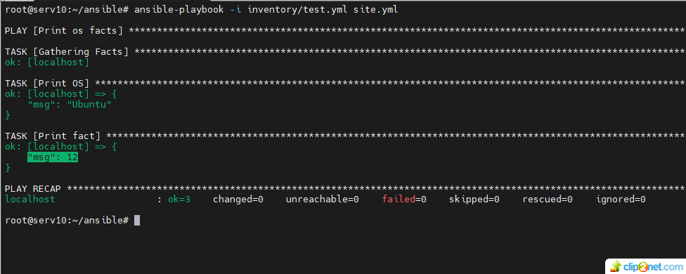
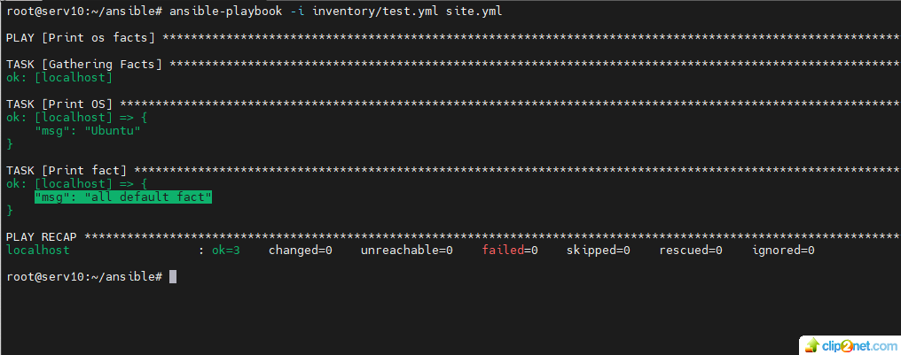
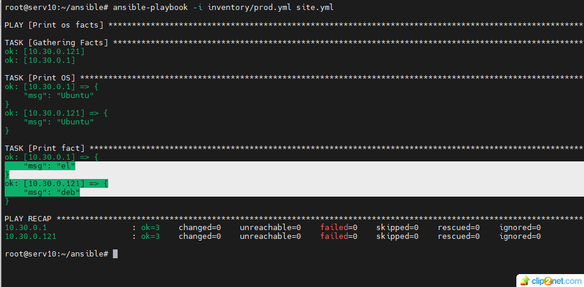
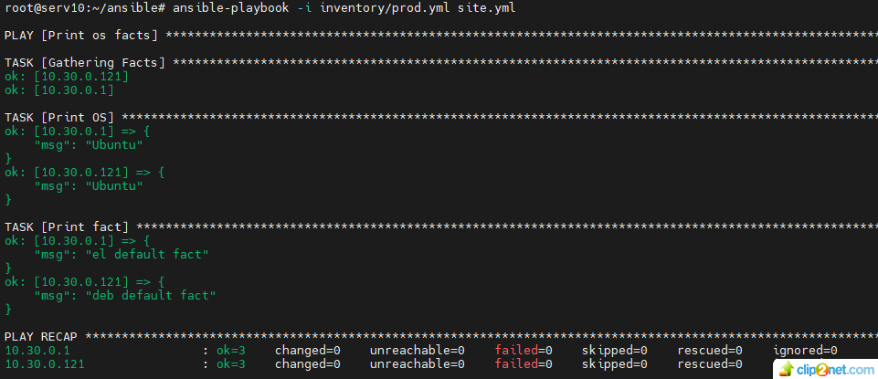
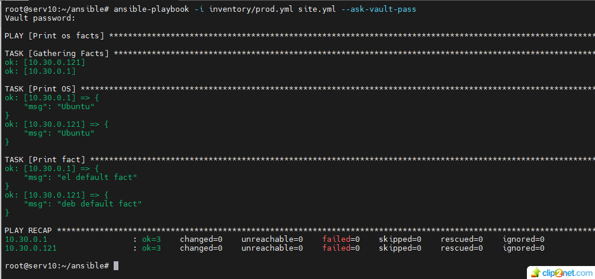
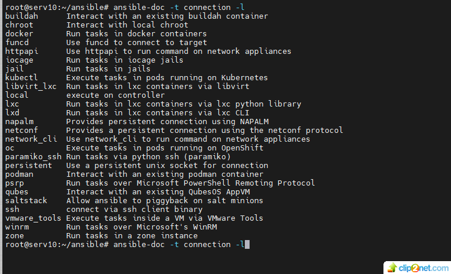
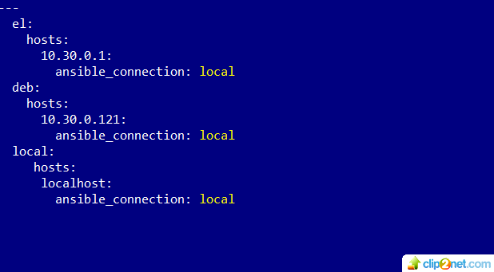
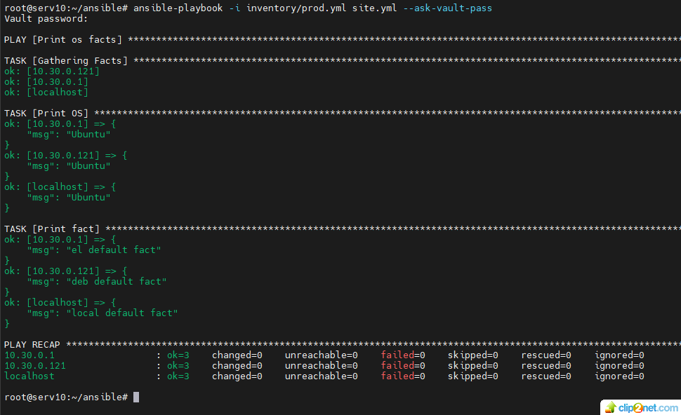

## Домашнее задание к занятию 1 «Введение в Ansible»

#### 1. Попробуйте запустить playbook на окружении из test.yml, зафиксируйте значение, которое имеет факт some_fact для указанного хоста при выполнении playbook.
* решение

01: 
 
#### 2. Найдите файл с переменными (group_vars), в котором задаётся найденное в первом пункте значение, и поменяйте его на all default fact.
* решение

02: 

#### 3. Воспользуйтесь подготовленным (используется docker) или создайте собственное окружение для проведения дальнейших испытаний.
* решение 
* Создал собственное окружение для проведения испытаний. Два сервера с IP - 10.30.0.1 and 10.30.0.121

#### 4. Проведите запуск playbook на окружении из prod.yml. Зафиксируйте полученные значения some_fact для каждого из managed host.
* решение 
 
03: 

#### 5. Добавьте факты в group_vars каждой из групп хостов так, чтобы для some_fact получились значения: для deb — deb default fact, для el — el default fact.
* решение 
* изменил в файле /ansible/group_vars/deb/examp.yml some_fact: с "deb" на "deb default fact"
* изменил в файле /ansible/group_vars/el/examp.yml some_fact: с "el" на "el default fact"

#### 6. Повторите запуск playbook на окружении prod.yml. Убедитесь, что выдаются корректные значения для всех хостов.

04: 

#### 7. При помощи ansible-vault зашифруйте факты в group_vars/deb и group_vars/el с паролем netology.
* решение 

05: 

#### 8. Запустите playbook на окружении prod.yml. При запуске ansible должен запросить у вас пароль. Убедитесь в работоспособности.

06: 

#### 9. Посмотрите при помощи ansible-doc список плагинов для подключения.
* решение
* список плагинов для подключения можно посмотреть командой: ansible-doc -t connection -l

09: 

#### 10. В prod.yml добавьте новую группу хостов с именем local, в ней разместите localhost с необходимым типом подключения.
* решение 

07: 

#### 11. Запустите playbook на окружении prod.yml. При запуске ansible должен запросить у вас пароль. Убедитесь, что факты some_fact для каждого из хостов определены из верных group_vars.
* решение 

08: 

## END