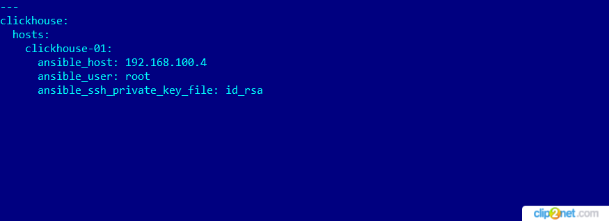

## Домашнее задание к занятию 2 «Работа с Playbook»

####  1. Подготовьте свой inventory-файл `prod.yml`.
* решение

01: 

#### 2. Допишите playbook: нужно сделать ещё один play, который устанавливает и настраивает [vector](https://vector.dev). Конфигурация vector должна деплоиться через template файл jinja2. От вас не требуется использовать все возможности шаблонизатора, просто вставьте стандартный конфиг в template файл. Информация по шаблонам по [ссылке](https://www.dmosk.ru/instruktions.php?object=ansible-nginx-install).
* решение 

02: 

#### 3. При создании tasks рекомендую использовать модули: `get_url`, `template`, `unarchive`, `file`.

#### 4. Tasks должны: скачать дистрибутив нужной версии, выполнить распаковку в выбранную директорию, установить vector.

#### 5. Запустите `ansible-lint site.yml` и исправьте ошибки, если они есть.
* решение

03: 

#### 6. Попробуйте запустить playbook на этом окружении с флагом `--check`.
* решение
* TASK [Install clickhouse packages] не выполнилась, т. к. пакетов для установки еще нет

04: 

#### 7. Запустите playbook на `prod.yml` окружении с флагом `--diff`. Убедитесь, что изменения на системе произведены.
* решение: вывод команды ansible-playbook site.yml --diff (на один экран не входит, скриншот не удобно делать)  
* ссылка на файл: 

#### 8. Повторно запустите playbook с флагом `--diff` и убедитесь, что playbook идемпотентен.
* решение 

06: 

#### 9. Подготовьте README.md-файл по своему playbook. В нём должно быть описано: что делает playbook, какие у него есть параметры и теги. Пример качественной документации ansible playbook по [ссылке](https://github.com/opensearch-project/ansible-playbook).
* решение
* Для установки Vector в плейбуук дописал плей - name: Install Vector. 
* Создал задачи: - name: Get vector distrib, - name: Create directrory for vector, - name: Extract Vector, - name: Set template for config vector. 
* Все задачи пометил тагом - tags: vector. 
* Использовал модули: get_url, file, unarchive, template. 
* Шаблон в конфиге вектора, по пути /opt/vector/config/vector.yaml устанавливает два параметра, используя переменные: 
* dummy_logs_type: "my_demo_logs", 
* parse_logs_type: "my_remap".

#### 10. Готовый playbook выложите в свой репозиторий, поставьте тег `08-ansible-02-playbook` на фиксирующий коммит, в ответ предоставьте ссылку на него.
* ссылка на inventory: 
* ссылка на playbook: 
* ссылка на vars: 

## END