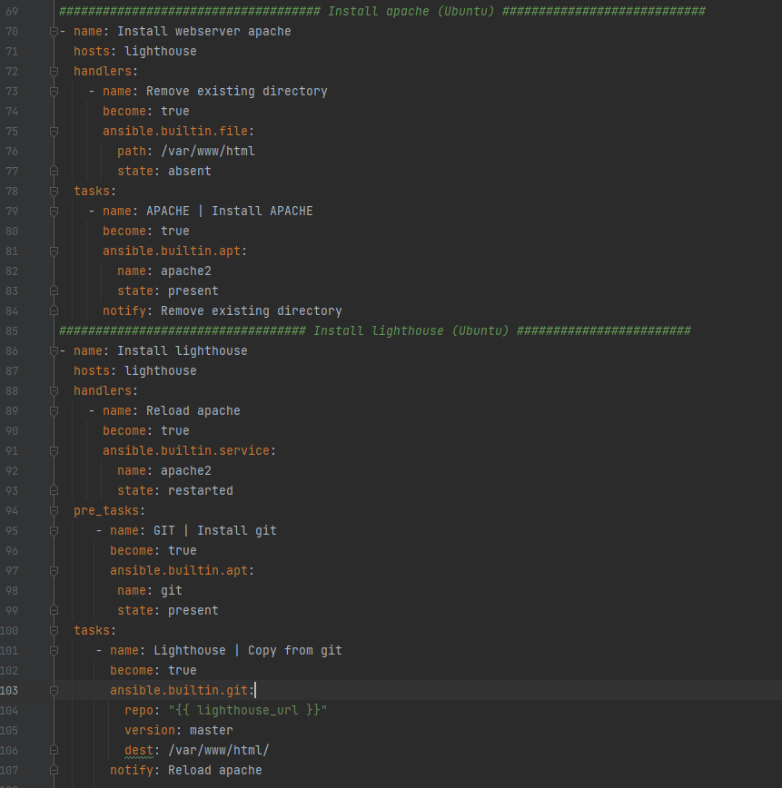
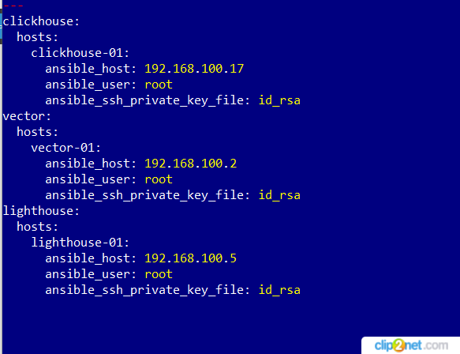
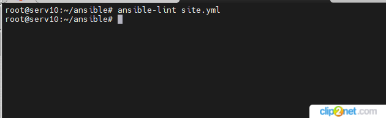
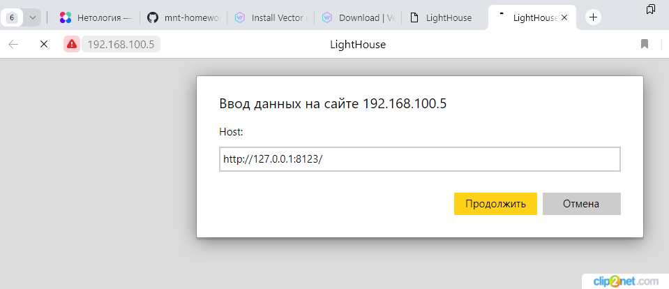

## Домашнее задание к занятию 3 «Использование Ansible»

#### Допишите playbook: нужно сделать ещё один play, который устанавливает и настраивает LightHouse.
* решение

01: 

#### При создании tasks рекомендую использовать модули: `get_url`, `template`, `yum`, `apt`.
#### Tasks должны: скачать статику LightHouse, установить Nginx или любой другой веб-сервер, настроить его конфиг для открытия LightHouse, запустить веб-сервер.
#### Подготовьте свой inventory-файл `prod.yml`.
* решение

02: 

#### Запустите `ansible-lint site.yml` и исправьте ошибки, если они есть.
* решение

03: 

#### Подготовьте README.md-файл по своему playbook. В нём должно быть описано: что делает playbook, какие у него есть параметры и теги.
* решение
* Для установки LightHouse в плейбуук дописал плей - name: Install lighthouse
* Сделал плей для установки веб-сервера - name: Install webserver apache
* Использовал модули: ansible.builtin.apt, ansible.builtin.git, ansible.builtin.service

#### Готовый playbook выложите в свой репозиторий, поставьте тег `08-ansible-03-yandex` на фиксирующий коммит, в ответ предоставьте ссылку на него.
* Проверка LightHouse:

04: 

* ссылка на playbook: https://github.com/staratel74/devops-netology/blob/main/Ansible/Task_03/site.yml

## END