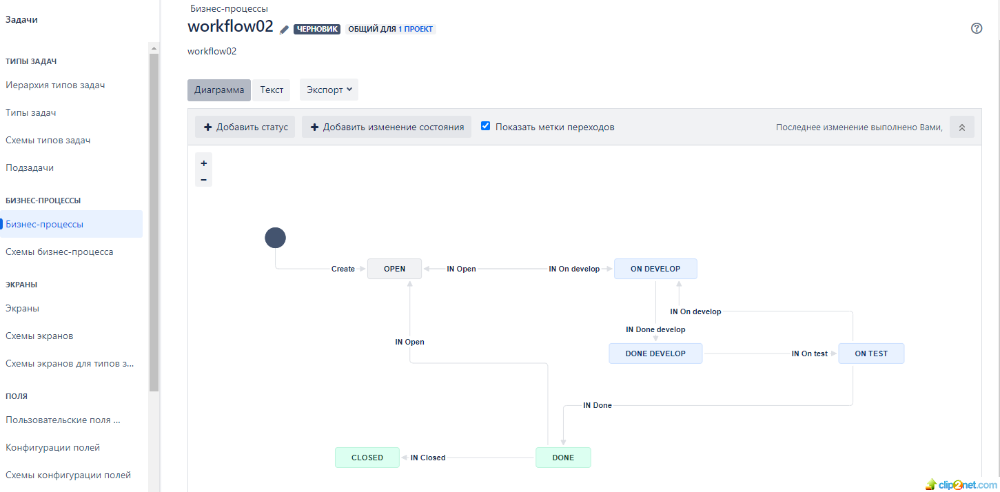

## Домашнее задание к занятию 7 «Жизненный цикл ПО» 

#### 1. Создайте задачу с типом bug, попытайтесь провести его по всему workflow до Done.
#### 2. Создайте задачу с типом epic, к ней привяжите несколько задач с типом task, проведите их по всему workflow до Done.
#### 3. При проведении обеих задач по статусам используйте kanban.
* решение

01: 

#### 4. Верните задачи в статус Open.

02: 

#### 5. Перейдите в Scrum, запланируйте новый спринт, состоящий из задач эпика и одного бага, стартуйте спринт, проведите задачи до состояния Closed. Закройте спринт.

03: 

04: 

#### 6. Если всё отработалось в рамках ожидания — выгрузите схемы workflow для импорта в XML. Файлы с workflow и скриншоты workflow приложите к решению задания.

05: 

Ссылка на workflow.xml: https://github.com/staratel74/devops-netology/blob/main/CI_CD/Task_01/workflow.xml
 

## Домашнее задание к занятию 7 «Жизненный цикл ПО» ДОРАБОТКА
* создал второй workflow02, для остальных задач.

06: 

* создал задачу с типом epic, к ней привязал две задачи с типом task и провел их по всему workflow02, до Done
add
07: 

Ссылка на workflow02.xml: https://github.com/staratel74/devops-netology/blob/main/CI_CD/Task_01/workflow02.xml

## END