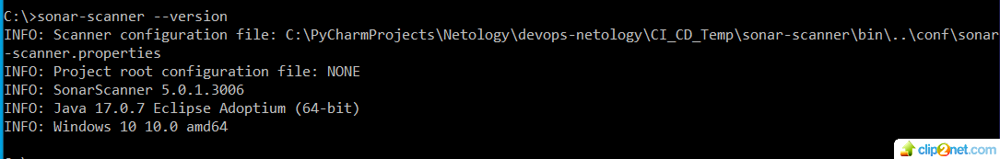
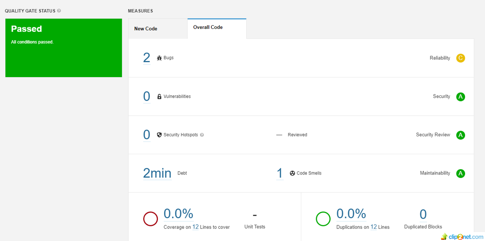
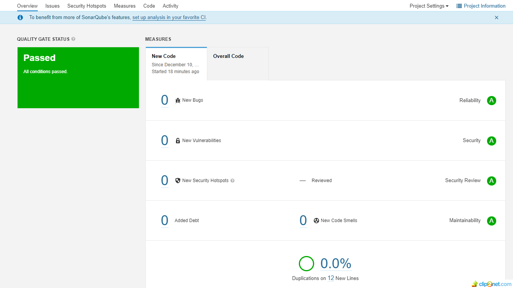
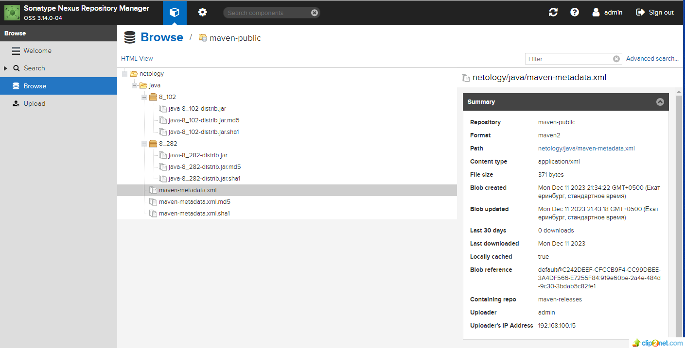
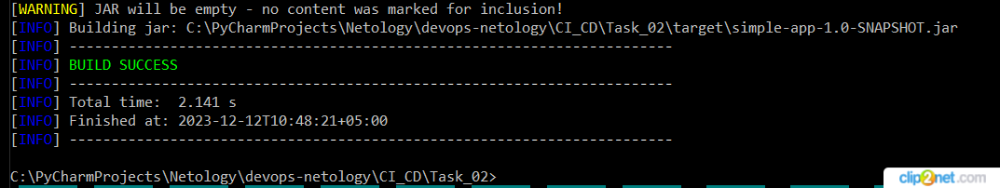

## Домашнее задание к занятию 9 «Процессы CI/CD»
 
### Знакомоство с SonarQube 
### Основная часть
#### Создайте новый проект, название произвольное.
#### Скачайте пакет sonar-scanner, который вам предлагает скачать SonarQube.
#### Сделайте так, чтобы binary был доступен через вызов в shell (или поменяйте переменную PATH, или любой другой, удобный вам способ).
#### Проверьте sonar-scanner --version.
* решение

01: 

#### Запустите анализатор против кода из директории example с дополнительным ключом -Dsonar.coverage.exclusions=fail.py.
#### Посмотрите результат в интерфейсе.
* решение

02: 

#### Исправьте ошибки, которые он выявил, включая warnings.
#### Запустите анализатор повторно — проверьте, что QG пройдены успешно.
#### Сделайте скриншот успешного прохождения анализа, приложите к решению ДЗ.
* решение

03: 

### Знакомство с Nexus
### Основная часть
#### В репозиторий maven-public загрузите артефакт с GAV-параметрами:
#### groupId: netology;## 
#### artifactId: java;
#### version: 8_282;
#### classifier: distrib;
#### type: tar.gz.
#### В него же загрузите такой же артефакт, но с version: 8_102.
#### Проверьте, что все файлы загрузились успешно.
* решение

04: 

#### В ответе пришлите файл maven-metadata.xml для этого артефекта.
* ссылка на maven-metadata.xml: https://github.com/staratel74/devops-netology/blob/main/CI_CD/Task_02/maven-metadata.xml

## Знакомство с Maven
## Основная часть
#### Поменяйте в pom.xml блок с зависимостями под ваш артефакт из первого пункта задания для Nexus (java с версией 8_282).
#### Запустите команду mvn package в директории с pom.xml, ожидайте успешного окончания.
* решение

05: 

#### Проверьте директорию ~/.m2/repository/, найдите ваш артефакт.
#### В ответе пришлите исправленный файл pom.xml.
* ссылка на pom.xml: https://github.com/staratel74/devops-netology/blob/main/CI_CD/Task_02/pom.xml

## END