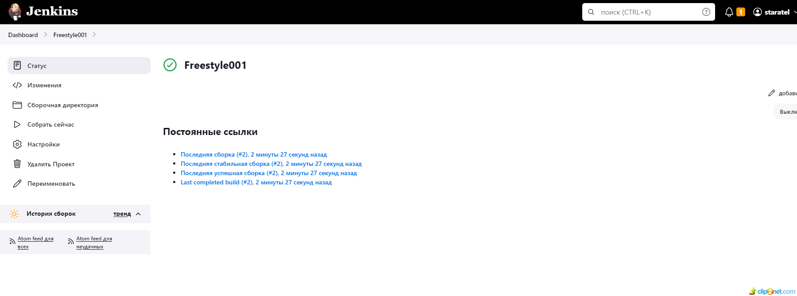
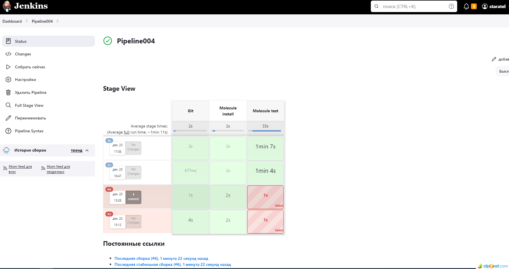
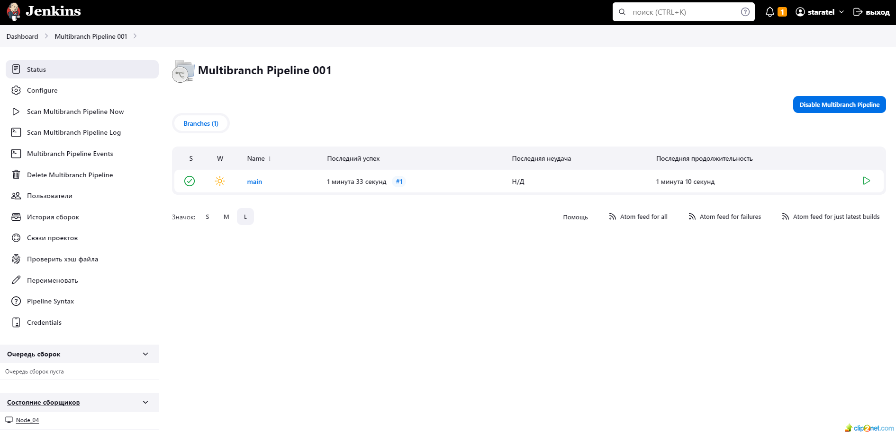
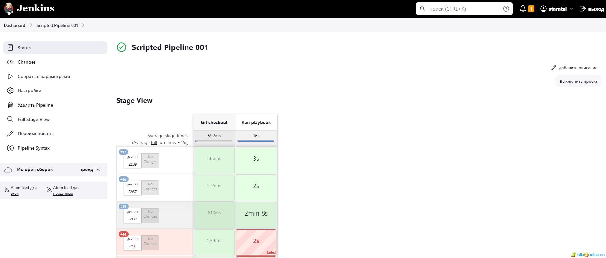

## ДДомашнее задание к занятию 10 «Jenkins»
 
#### Сделать Freestyle Job, который будет запускать molecule test из любого вашего репозитория с ролью.
* решение

01: 

#### Сделать Declarative Pipeline Job, который будет запускать molecule test из любого вашего репозитория с ролью.
* решение

02: 

#### Перенести Declarative Pipeline в репозиторий в файл Jenkinsfile.
#### Создать Multibranch Pipeline на запуск Jenkinsfile из репозитория.

* решение

03: 

#### Создать Scripted Pipeline, наполнить его скриптом из pipeline.
#### Внести необходимые изменения, чтобы Pipeline запускал ansible-playbook без флагов --check --diff, если не установлен параметр при запуске джобы (prod_run = True). По умолчанию параметр имеет значение False и запускает прогон с флагами --check --diff.
#### Проверить работоспособность, исправить ошибки, исправленный Pipeline вложить в репозиторий в файл ScriptedJenkinsfile.

* решение

04: 

#### Отправить ссылку на репозиторий с ролью и Declarative Pipeline и Scripted Pipeline.

* решение
* ссылка на роль vector-role - https://github.com/staratel74/ansible-role/tree/main/vector-role
* ссылка на Declarative Pipeline - https://github.com/staratel74/ansible-role/blob/main/vector-role/Jenkinsfile
* ссылка на Scripted Pipeline - https://github.com/staratel74/ansible-role/blob/main/vector-role/ScriptedJenkinsfile

## END