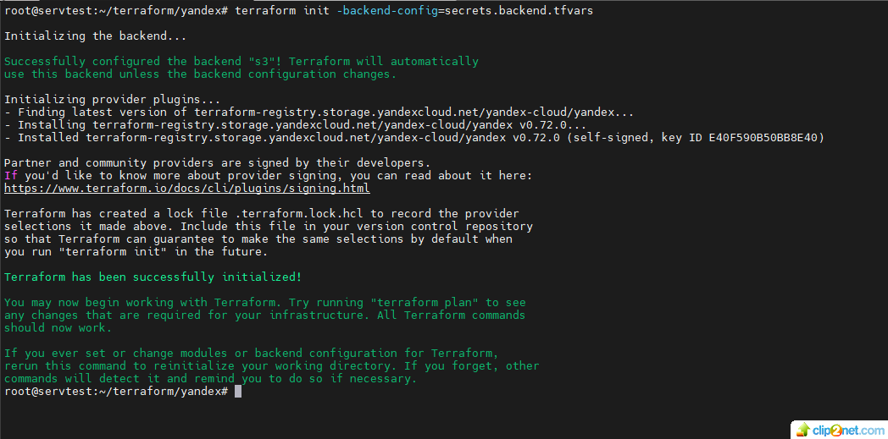
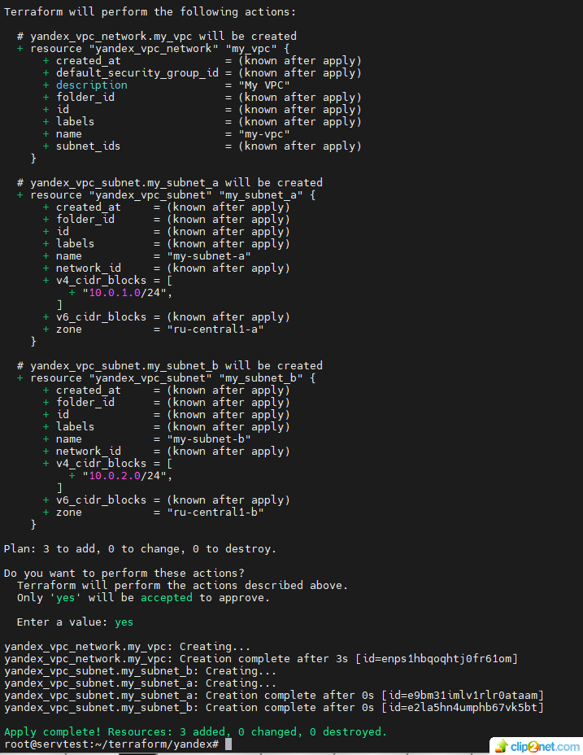

## Дипломный практикум в Yandex.Cloud ДОРАБОТКА

1.	Давайте применять принцип DRY (do not repeat yourself). Не копипастите ресурсы, а сделайте шаблонный код. 
    Аналогично для subnets. Выведи-те параметры в variables чтобы у вас получился шаблонный код и можно было менять только variables 
    и таким образом менять параметры кла-стера
* ответ: код поправил
* ссылка на main.tf - https://github.com/staratel74/devops-netology/blob/main/Diploma/Task_02/src/terraform/yyamodification/main.tf 
* ссылка на variables.tf - https://github.com/staratel74/devops-netology/blob/main/Diploma/Task_02/src/terraform/yyamodification/variables.tf

2.	Как получили конфиг? Руками создали?
* ответ: для установки кластера использовал ansible с Kubespray, предварительно настроив inventory под инфраструктуру.
* после создания кластера, подключился к мастерноде по ssh, забрал config на сервер где Jenkins установлен.
* Если парамет-ры кластера поменяются, терраформ пересоздаст но-вый кластер с новыми параметрами как будете созда-вать конфиг?
* ответ: при использовании в YC Managed Service for Kubernetes получить кубконфиг можно с помощью yc CLI
* 18: 
      
3. Как деплоили мониторинг? Руками?
* ответ: использовал пакет kube-prometheus

4. использовал Jenkins. Как и где он запущен? Как конфигурировался?
* ответ: Jenkins установил на ubuntu
* установил необходимые плагины: Git Plugin, Docker Plugin, Pipeline Plugin
* настроил credentials для доступа в репозитории GitHub, DokerHub и к кластеру k8s

5.	У вас хардкод версии в файле Jenkins? Не понял, как достигается версионность, как триггерится пайплайн по тегу?
* ответ: Jenkins опрашивает git repository по расписанию
* 17: 
* исправил pipeline, теперь проверяется тег и если тег правильный (здесь он v1.10.9) запускается сборка докер образа, пушится в докерхаб и деплоится в кластер k8s   
* ссылка на Jenkinsfile - https://github.com/staratel74/nginx-repo/blob/main/Jenkinsfile.groovy
6.	Почему сервис типа NodePort? не продакшн. Надо использовать HTTP/HTTPS
* ответ: поправил Service, сделал type: LoadBalancer. В YC поднялся Network Load Balancer.
* 19: 
* Теперь можно обойтись без порта:30000
* 20: 

## END

## Дипломный практикум в Yandex.Cloud

### Цели:

1. Подготовить облачную инфраструктуру на базе облачного провайдера Яндекс.Облако.
2. Запустить и сконфигурировать Kubernetes кластер.
3. Установить и настроить систему мониторинга.
4. Настроить и автоматизировать сборку тестового приложения с использованием Docker-контейнеров.
5. Настроить CI для автоматической сборки и тестирования.
6. Настроить CD для автоматического развёртывания приложения.

### Этапы выполнения:
#### Создание облачной инфраструктуры
Для начала необходимо подготовить облачную инфраструктуру в ЯО при помощи Terraform.

Особенности выполнения:

* Бюджет купона ограничен, что следует иметь в виду при проектировании инфраструктуры и использовании ресурсов; Для облачного k8s используйте региональный мастер(неотказоустойчивый). Для self-hosted k8s минимизируйте ресурсы ВМ и долю ЦПУ. В обоих вариантах используйте прерываемые ВМ для worker nodes.
* Следует использовать версию Terraform не старше 1.5.x .

Предварительная подготовка к установке и запуску Kubernetes кластера.

* Создайте сервисный аккаунт, который будет в дальнейшем использоваться Terraform для работы с инфраструктурой с необходимыми и достаточными правами. Не стоит использовать права суперпользователя
  * Note for my: сервисный аккаунт (sun) завел через UI 
* Подготовьте backend для Terraform: а. Рекомендуемый вариант: S3 bucket в созданном ЯО аккаунте(создание бакета через TF) б. Альтернативный вариант: Terraform Cloud
  * решение: сделал с через TF S3 bucket
  * 01: 
  * 02: 
  * ссылка на bucket.tf - https://github.com/staratel74/devops-netology/blob/main/Diploma/Task_02/src/terraform/bucket/bucket.tf
  * сделал backend в S3 bucket, созданном ЯО аккаунте
  * 03: 
  * 04: 
  * ссылка на backend.tf - https://github.com/staratel74/devops-netology/blob/main/Diploma/Task_02/src/terraform/backend.tf
* Создайте VPC с подсетями в разных зонах доступности.
  * решение:
  * 05: 
  * 06: 
* Убедитесь, что теперь вы можете выполнить команды terraform destroy и terraform apply без дополнительных ручных действий.
  * решение:
  * 07: 
  * 08: 
  * ссылка на main.tf - https://github.com/staratel74/devops-netology/blob/main/Diploma/Task_02/src/terraform/main.tf 
* В случае использования Terraform Cloud в качестве backend убедитесь, что применение изменений успешно проходит, используя web-интерфейс Terraform cloud.

Ожидаемые результаты:

* Terraform сконфигурирован и создание инфраструктуры посредством Terraform возможно без дополнительных ручных действий.
* Полученная конфигурация инфраструктуры является предварительной, поэтому в ходе дальнейшего выполнения задания возможны изменения.

#### Создание Kubernetes кластера

Ожидаемый результат:

* Работоспособный Kubernetes кластер.
* В файле ~/.kube/config находятся данные для доступа к кластеру.
* Команда kubectl get pods --all-namespaces отрабатывает без ошибок.
  * решение: воспользовался, пакетом Kubespray
  * 09: 
  * ссылка на config - https://github.com/staratel74/devops-netology/blob/main/Diploma/Task_02/src/k8s/config

#### Создание тестового приложения

Ожидаемый результат:

* Git репозиторий с тестовым приложением и Dockerfile.
* Регистри с собранным docker image. В качестве регистри может быть DockerHub или Yandex Container Registry, созданный также с помощью terraform.
  * решение:
  * ссылка на Git репозиторий с тестовым приложением и Dockerfile - https://github.com/staratel74/nginx-repo/tree/main
  * ссылка на регистри с собранным docker image - https://hub.docker.com/repository/docker/staratel/nginx-repo/general

#### Подготовка cистемы мониторинга и деплой приложения

Цель:

* Задеплоить в кластер prometheus, grafana, alertmanager, экспортер основных метрик Kubernetes.
* Задеплоить тестовое приложение, например, nginx сервер отдающий статическую страницу.
  * решение:
  * 10: 
  * 11: 
  * 12: 
  * 13: 

#### Установка и настройка CI/CD

Цель:

* Автоматическая сборка docker образа при коммите в репозиторий с тестовым приложением.
* Автоматический деплой нового docker образа.
  * решение: использовал Jenkins
  * 14: 
  * Отредактировал index.html, прописал - Hello! This is my diploma v1.10.0 Сделал коммит, запушил в репозиторий https://github.com/staratel74/nginx-repo В Jenkins запустилась job Diploma_Pipeline, отработал pipeline. 
  * Ссылка на JenkinsConsoleOutput.txt - https://github.com/staratel74/devops-netology/blob/main/Diploma/Task_02/src/JenkinsConsoleOutput.txt
  * 15: 
  * 16: 

## END