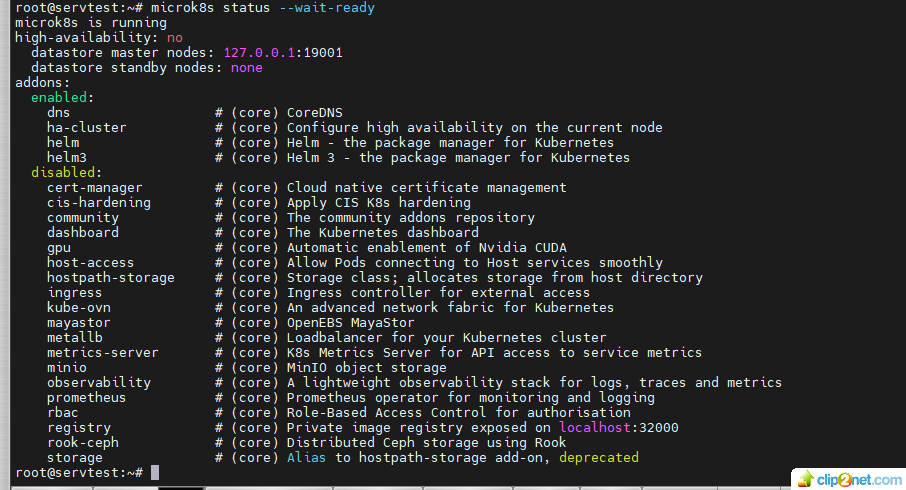
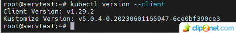
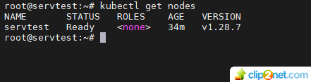
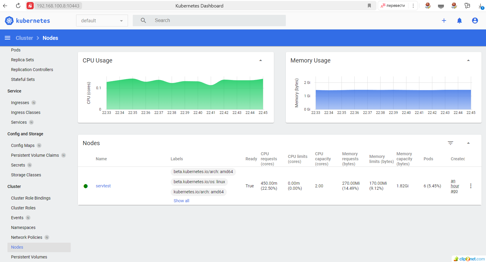

## Домашнее задание к занятию «Kubernetes. Причины появления. Команда kubectl»

### Цель задания
Для экспериментов и валидации ваших решений вам нужно подготовить тестовую среду для работы с Kubernetes. Оптимальное решение — развернуть на рабочей машине или на отдельной виртуальной машине MicroK8S.

### Задание 1. Установка MicroK8S
#### Установить MicroK8S на локальную машину или на удалённую виртуальную машину.
* решение:

Установил MicroK8S на ВМ (VirtualBox), Ubuntu 22.04.2 LTS на локальной машине
 
snap install microk8s --classic

01: 

#### Установить dashboard.
* решение:

microk8s enable dashboard

### Задание 2. Установка и настройка локального kubectl

#### Установить на локальную машину kubectl.
* решение:

02: 

#### Настроить локально подключение к кластеру.
* решение:

Получил сонфигурацию кластера microk8s:

root@servtest:~# microk8s config

Установил параметры в .kube/config

03: 

#### Подключиться к дашборду с помощью port-forward.
* решение:

04: 

## END