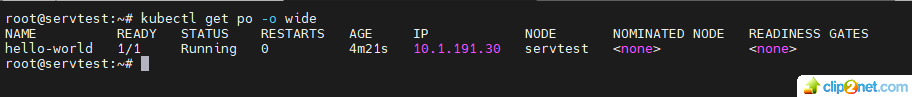
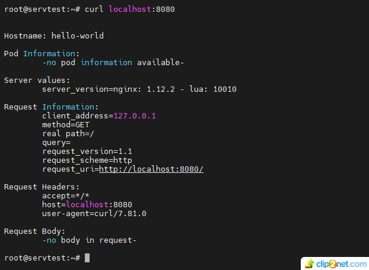
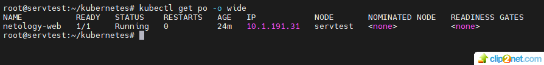
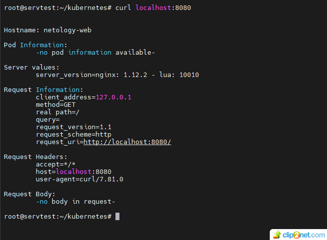

## Домашнее задание к занятию «Базовые объекты K8S»

### Цель задания В тестовой среде для работы с Kubernetes, установленной в предыдущем ДЗ, необходимо развернуть Pod с приложением и подключиться к нему со своего локального компьютера.

#### Задание 1. Создать Pod с именем hello-world

1. Создать манифест (yaml-конфигурацию) Pod.
2. Использовать image - gcr.io/kubernetes-e2e-test-images/echoserver:2.2.
3. Подключиться локально к Pod с помощью kubectl port-forward и вывести значение (curl или в браузере).
* решение:

01: 

02: 

* ссылка на манифест для pod-hello-world: https://github.com/staratel74/devops-netology/blob/main/Kubernetes/Task_02/pod-hello-world.yaml  

#### Задание 2. Создать Service и подключить его к Pod
1. Создать Pod с именем netology-web.
2. Использовать image — gcr.io/kubernetes-e2e-test-images/echoserver:2.2.
3. Создать Service с именем netology-svc и подключить к netology-web.
4. Подключиться локально к Service с помощью kubectl port-forward и вывести значение (curl или в браузере).

03: 

04: 

* ссылка на манифест для pod-netology-web: https://github.com/staratel74/devops-netology/blob/main/Kubernetes/Task_02/pod-netology-web.yaml
* ссылка на манифест для netology-svc: https://github.com/staratel74/devops-netology/blob/main/Kubernetes/Task_02/netology-svc.yaml 

## END