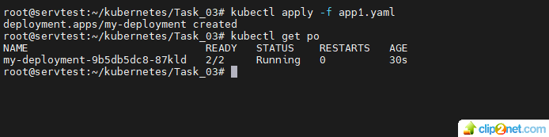
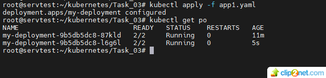
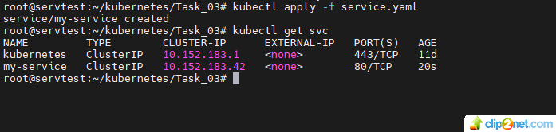
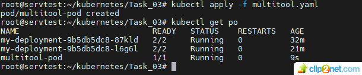
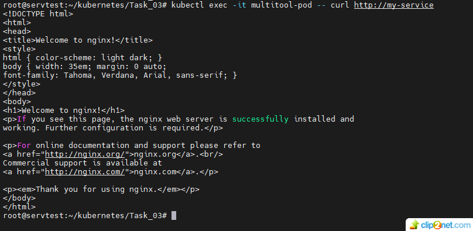
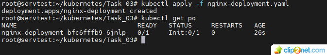
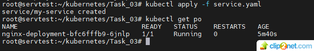

## Домашнее задание к занятию «Запуск приложений в K8S»

### В тестовой среде для работы с Kubernetes, установленной в предыдущем ДЗ, необходимо развернуть Deployment с приложением, состоящим из нескольких контейнеров, и масштабировать его. 

#### Задание 1. Создать Deployment и обеспечить доступ к репликам приложения из другого Pod
1. Создать Deployment приложения, состоящего из двух контейнеров — nginx и multitool. Решить возникшую ошибку.
* решение: 
* создаем Deployment (name: my-deployment), используя манифест - app1.yaml, одна реплика.  
01: 
2. После запуска увеличить количество реплик работающего приложения до 2.
* решение:
* устанавливаем значение replicas: 2 и модифицируем Deployment (name: my-deployment), используя манифест - app1.yaml, две реплики.
02: 

3. Продемонстрировать количество подов до и после масштабирования.
4. Создать Service, который обеспечит доступ до реплик приложений из п.1.
* решение:
* создаем сервис (name: my-service), используя манифест - service.yaml
03: 
5. Создать отдельный Pod с приложением multitool и убедиться с помощью curl, что из пода есть доступ до приложений из п.1.
* решение:
* создаем Pod (name: multitool-pod), используя манифест - multitool.yaml
* 04: 
* проверяем с помощью curl, что из пода есть доступ до приложений из п.1.
* 05: 
* ссылки на манифесты:
* app1.yaml (одна реплика) - https://github.com/staratel74/devops-netology/blob/main/Kubernetes/Task_03/app1.yaml
* app2.yaml (две реплики) - https://github.com/staratel74/devops-netology/blob/main/Kubernetes/Task_03/app2.yaml
* multitool.yaml - https://github.com/staratel74/devops-netology/blob/main/Kubernetes/Task_03/multitool.yaml
* service.yaml - https://github.com/staratel74/devops-netology/blob/main/Kubernetes/Task_03/service.yaml

#### Задание 2. Создать Deployment и обеспечить старт основного контейнера при выполнении условий
1. Создать Deployment приложения nginx и обеспечить старт контейнера только после того, как будет запущен сервис этого приложения.
2. Убедиться, что nginx не стартует. В качестве Init-контейнера взять busybox.
* решение:
* Для Deployment создадим манифест - nginx-deployment.yaml с init-контейнером, который проверит запущен или нет сервис - name: my-service
* запускаем nginx-deployment.yaml без запущенного сервиса и смотрим на поды, контейнер не стартует:
* 06: 
3. Создать и запустить Service. Убедиться, что Init запустился.
4. Продемонстрировать состояние пода до и после запуска сервиса.
* решение:
* стартуем сервис  - name: my-service и смотрим на поды, контейнер - Running:
* 07: 
* ссылка на манифест:
* nginx-deployment.yaml - https://github.com/staratel74/devops-netology/blob/main/Kubernetes/Task_03/nginx-deployment.yaml 

## END