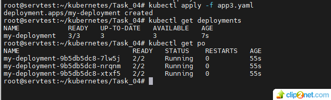
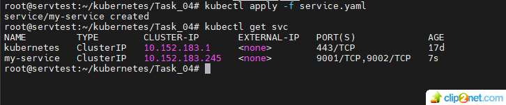
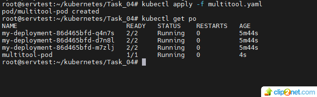
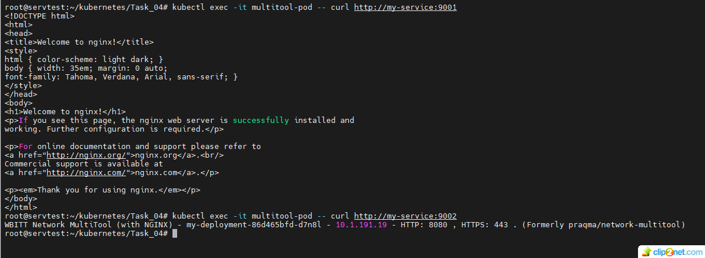
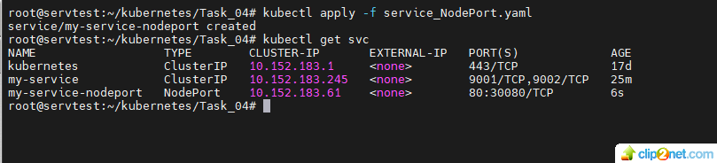
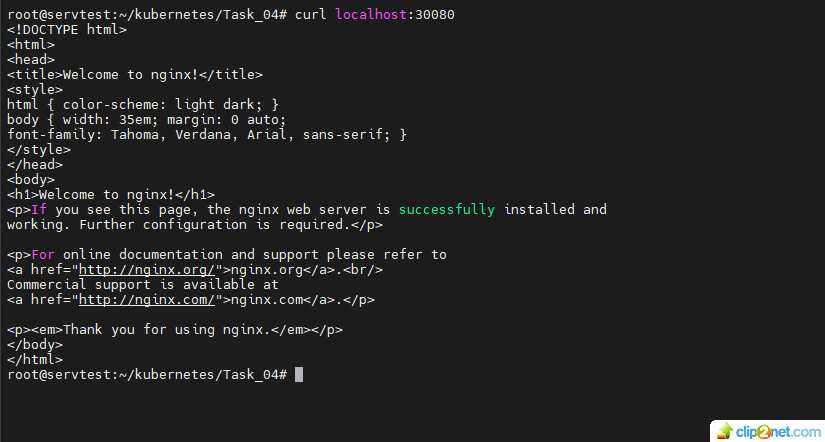

## Домашнее задание к занятию «Сетевое взаимодействие в K8S. Часть 1»

### Цель задания 
#### В тестовой среде Kubernetes необходимо обеспечить доступ к приложению, установленному в предыдущем ДЗ и состоящему из двух контейнеров, по разным портам в разные контейнеры как внутри кластера, так и снаружи.

#### Задание 1. Создать Deployment и обеспечить доступ к контейнерам приложения по разным портам из другого Pod внутри кластера
1. Создать Deployment приложения, состоящего из двух контейнеров (nginx и multitool), с количеством реплик 3 шт.
* решение:
* 01: 
* ссылка на манифест Deployment - https://github.com/staratel74/devops-netology/blob/main/Kubernetes/Task_04/app3.yaml
2. Создать Service, который обеспечит доступ внутри кластера до контейнеров приложения из п.1 по порту 9001 — nginx 80, по 9002 — multitool 8080.
* решение:
* 02: 
* ссылка на манифест Service - https://github.com/staratel74/devops-netology/blob/main/Kubernetes/Task_04/service.yaml
3. Создать отдельный Pod с приложением multitool и убедиться с помощью curl, что из пода есть доступ до приложения из п.1 по разным портам в разные контейнеры.
4. Продемонстрировать доступ с помощью curl по доменному имени сервиса.
5. Предоставить манифесты Deployment и Service в решении, а также скриншоты или вывод команды п.4.
* решение:
* 03: 
* ссылка на манифест multitool - https://github.com/staratel74/devops-netology/blob/main/Kubernetes/Task_04/multitool.yaml

* 04: 

#### Задание 2. Создать Service и обеспечить доступ к приложениям снаружи кластера
1. Создать отдельный Service приложения из Задания 1 с возможностью доступа снаружи кластера к nginx, используя тип NodePort.
2. Продемонстрировать доступ с помощью браузера или curl с локального компьютера.
3. Предоставить манифест и Service в решении, а также скриншоты или вывод команды п.2.
* решение:
* 05: 

* 06: 

ссылка на манифест Service-NodePort - https://github.com/staratel74/devops-netology/blob/main/Kubernetes/Task_04/service_NodePort.yaml

## END