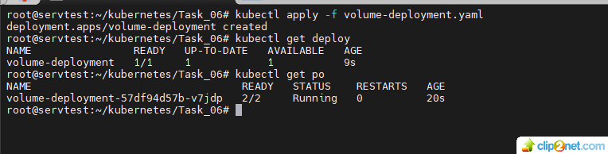
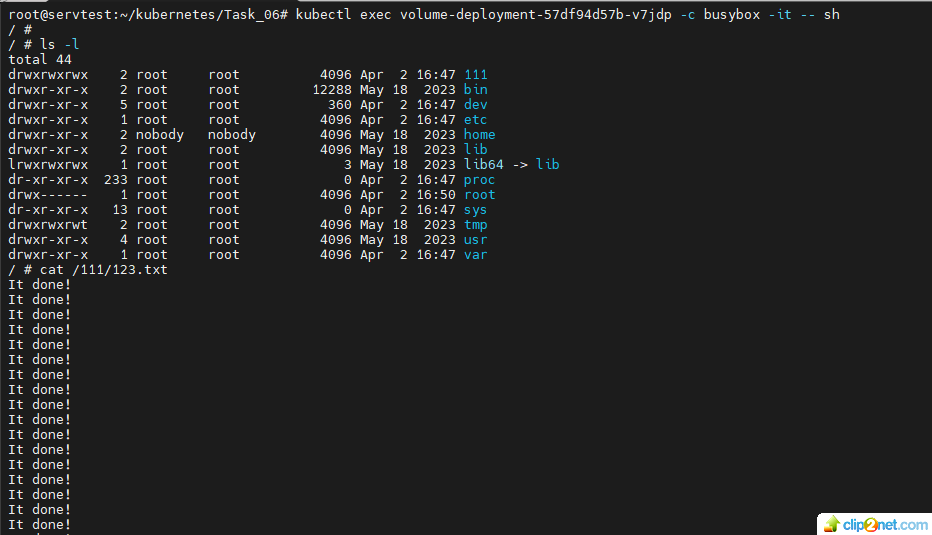
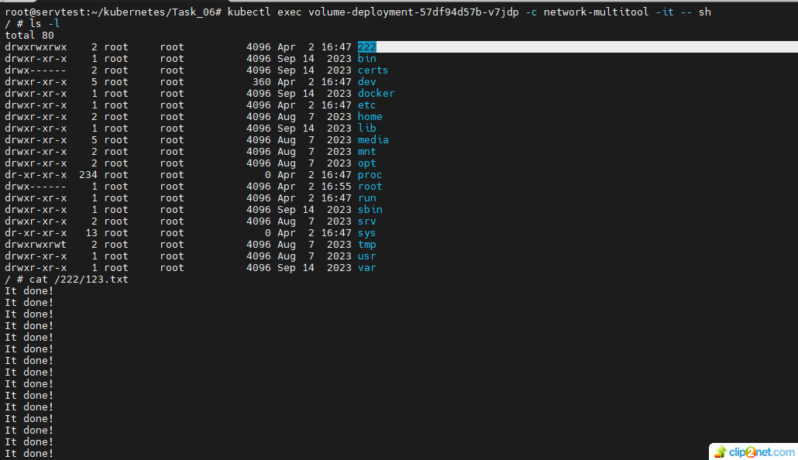
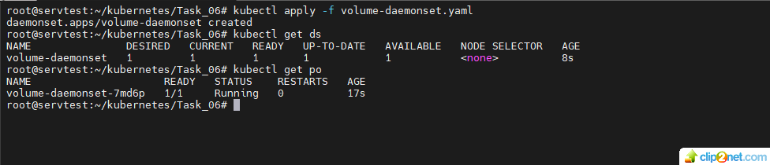
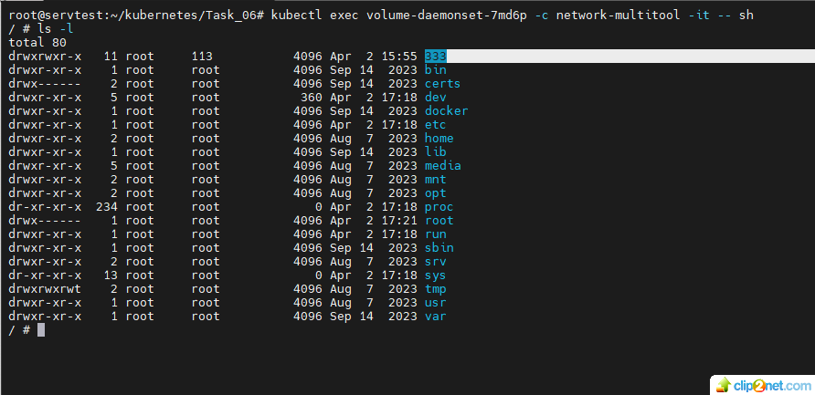
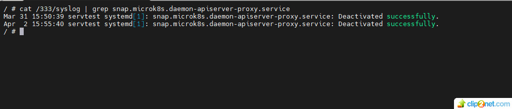

## Домашнее задание к занятию «Хранение в K8s. Часть 1» 

### Цель задания 
#### В тестовой среде Kubernetes нужно обеспечить обмен файлами между контейнерам пода и доступ к логам ноды. 

#### Задание 1. Создать Deployment приложения, состоящего из двух контейнеров и обменивающихся данными.
1. Создать Deployment приложения, состоящего из контейнеров busybox и multitool.
* решение:
* 01: 
2. Сделать так, чтобы busybox писал каждые пять секунд в некий файл в общей директории.
* решение:
* 02: 
3. Обеспечить возможность чтения файла контейнером multitool.
4. Продемонстрировать, что multitool может читать файл, который периодоически обновляется.
5. Предоставить манифесты Deployment в решении, а также скриншоты или вывод команды из п. 4.
* 03: 
* ссылка на манифест volume-deployment.yaml - 

#### Задание 2. Создать DaemonSet приложения, которое может прочитать логи ноды.
1. Создать DaemonSet приложения, состоящего из multitool.
* решение:
* 04: 
2. Обеспечить возможность чтения файла /var/log/syslog кластера MicroK8S.
3. Продемонстрировать возможность чтения файла изнутри пода.
4. Предоставить манифесты Deployment, а также скриншоты или вывод команды из п. 2.
* решение:
* 05: 

* 06: 
* ссылка на манифест volume-daemonset.yaml -

## END