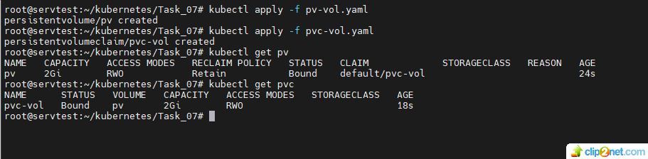
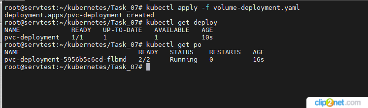
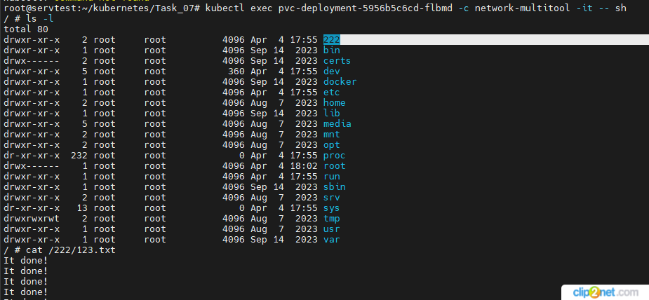
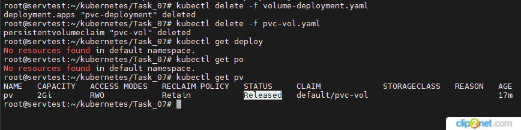
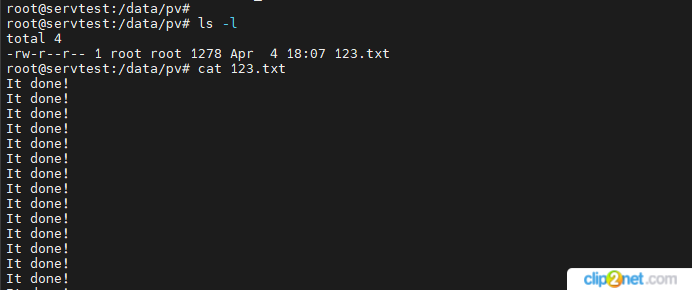
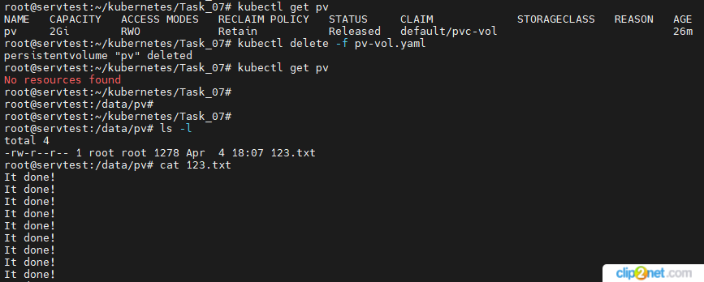
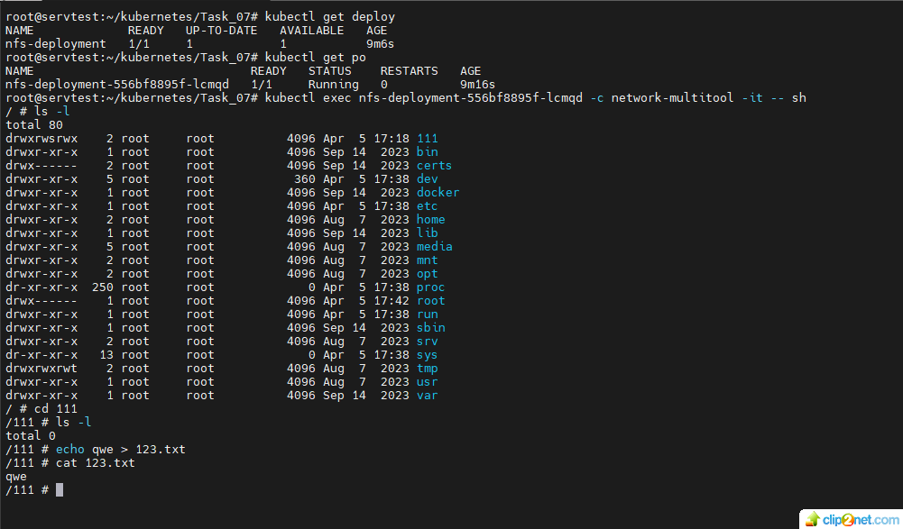

## Домашнее задание к занятию «Хранение в K8s. Часть 2»

### Цель задания 
#### В тестовой среде Kubernetes нужно создать PV и продемострировать запись и хранение файлов. 

#### Задание 1. Создать Deployment приложения, использующего локальный PV, созданный вручную.
1. Создать Deployment приложения, состоящего из контейнеров busybox и multitool.
2. Создать PV и PVC для подключения папки на локальной ноде, которая будет использована в поде.
* решение:
* создаем PV and PVC
* 01: 
* cоздаeм Deployment
* 02: 
3. Продемонстрировать, что multitool может читать файл, в который busybox пишет каждые пять секунд в общей директории.
* решение:
* 03: 
4. Удалить Deployment и PVC. Продемонстрировать, что после этого произошло с PV. Пояснить, почему.
* решение:
* 04: 
* так как PVC удалил, статус у PV сменился с Bound на Released
5. Продемонстрировать, что файл сохранился на локальном диске ноды. Удалить PV. Продемонстрировать что произошло с файлом после удаления PV. Пояснить, почему.
* 05: 

* удаляю PV, фай остался на файловой системе ноды, потому что у PV тип volume был - hostPath
* 06: 

6. Предоставить манифесты, а также скриншоты или вывод необходимых команд.
* ссылка на volume-deployment.yaml - https://github.com/staratel74/devops-netology/blob/main/Kubernetes/Task_07/volume-deployment.yaml
* ссылка на pv-vol.yaml - https://github.com/staratel74/devops-netology/blob/main/Kubernetes/Task_07/pv-vol.yaml
* ссылка на pvc-vol.yaml - https://github.com/staratel74/devops-netology/blob/main/Kubernetes/Task_07/pvc-vol.yaml

#### Задание 2. Создать Deployment приложения, которое может хранить файлы на NFS с динамическим созданием PV. 
1. Включить и настроить NFS-сервер на MicroK8S.
2. Создать Deployment приложения состоящего из multitool, и подключить к нему PV, созданный автоматически на сервере NFS.
3. Продемонстрировать возможность чтения и записи файла изнутри пода.
* решение:
* 07: 
4. Предоставить манифесты, а также скриншоты или вывод необходимых команд.
* ссылка на volume-deployment-2.yaml - https://github.com/staratel74/devops-netology/blob/main/Kubernetes/Task_07/volume-deployment-2.yaml
* ссылка на pvc-nfs.yaml - https://github.com/staratel74/devops-netology/blob/main/Kubernetes/Task_07/pvc-nfs.yaml
## END