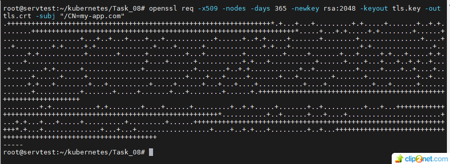

## Домашнее задание к занятию «Конфигурация приложений» 

### Цель задания 
#### В тестовой среде Kubernetes необходимо создать конфигурацию и продемонстрировать работу приложения.

#### Задание 1. Создать Deployment приложения и решить возникшую проблему с помощью ConfigMap. Добавить веб-страницу

1. Создать Deployment приложения, состоящего из контейнеров nginx и multitool. 
2. Решить возникшую проблему с помощью ConfigMap.
3. Продемонстрировать, что pod стартовал и оба конейнера работают.
* решение:
* создаем Deployment - myapp-pod без ConfigMap, контейнеры не стартуют
* сoздаем ConfigMap index-html-configmap, контейнеры стартанули
* 01: 
4. Сделать простую веб-страницу и подключить её к Nginx с помощью ConfigMap. Подключить Service и показать вывод curl или в браузере.
* решение:
* создаем Service
* 02: 
* смотрим web-страницу curl 192.168.100.8:32000
* 03: 
5. Предоставить манифесты, а также скриншоты или вывод необходимых команд.
* ссылка на deployment-2.yaml - 
* ссылка на index-html-configmap.yaml - 
* ссылка на myservice.yaml -  

#### Задание 2. Создать приложение с вашей веб-страницей, доступной по HTTPS

1. Создать Deployment приложения, состоящего из Nginx.
2. Создать собственную веб-страницу и подключить её как ConfigMap к приложению.
* решение:
* 04: 
3. Выпустить самоподписной сертификат SSL. Создать Secret для использования сертификата.
* решение:
* 05: 

* 06: 
4. Создать Ingress и необходимый Service, подключить к нему SSL в вид. Продемонстировать доступ к приложению по HTTPS.
* решение:
* 07: 
5. Предоставить манифесты, а также скриншоты или вывод необходимых команд.
* ссылка на deployment-nginx.yaml - 
* ссылка на index-html-configmap.yaml - 
* ссылка на secret.yaml -
* ссылка на ingress.yaml - 
* ссылка на myservice-nginx.yaml - 

## END