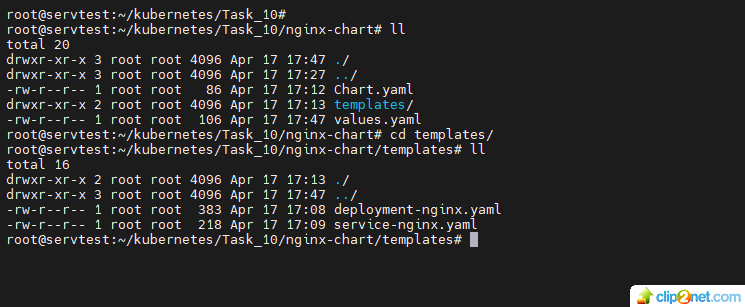
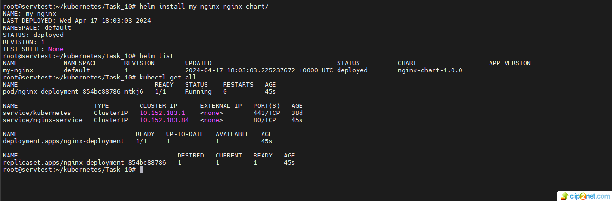
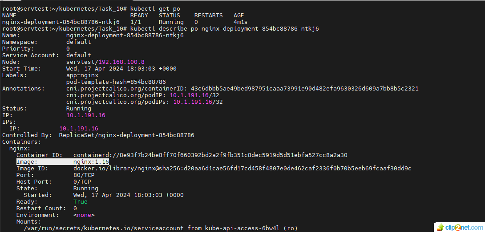
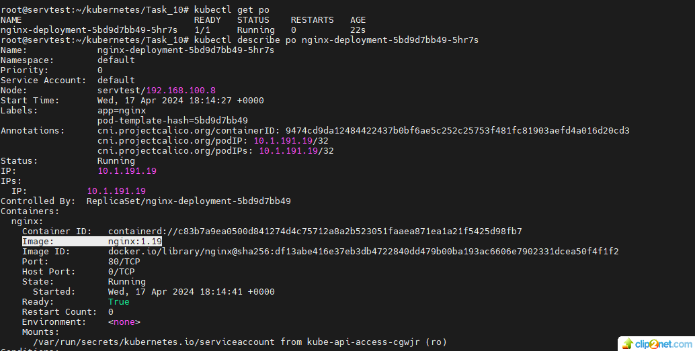
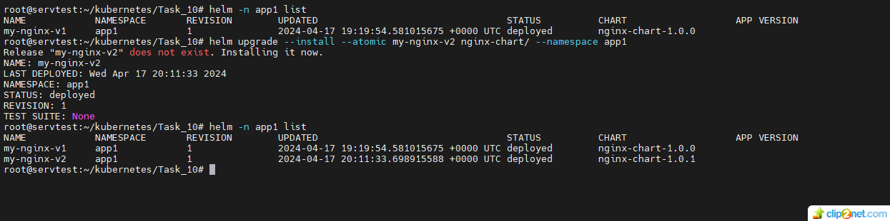
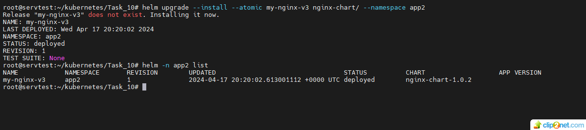

## Домашнее задание к занятию «Helm»

### Цель задания  
#### В тестовой среде Kubernetes необходимо установить и обновить приложения с помощью Helm.

#### Задание 1. Подготовить Helm-чарт для приложения

1. Необходимо упаковать приложение в чарт для деплоя в разные окружения.
2. Каждый компонент приложения деплоится отдельным deployment’ом или statefulset’ом.
* решение:
* создал структуру чарта:
* 01: 

* запустил и посмотрел что получилось:

* 02: 
3. В переменных чарта измените образ приложения для изменения версии.
* смотрим текущий образ образ Nginx:
* 03: 
* в values.yaml меняем tag: 1.16 НА tag: 1.19
* или выполняем: helm upgrade --install --atomic my-nginx nginx-chart/ --namespace app1 --set image.tag=1.19
* обновляем чарт и проверяем образ Nginx
* 04: 
 
                                                                                                  
#### Задание 2. Запустить две версии в разных неймспейсах

1. Подготовив чарт, необходимо его проверить. Запуститe несколько копий приложения.
2. Одну версию в namespace=app1, вторую версию в том же неймспейсе, третью версию в namespace=app2.
3. Продемонстрируйте результат
* решение:
* 05: 

* 06: 

* ссылка на Chart.yaml - https://github.com/staratel74/devops-netology/blob/main/Kubernetes/Task_10/Chart.yaml
* ссылка на values.yaml - https://github.com/staratel74/devops-netology/blob/main/Kubernetes/Task_10/values.yaml
* ссылка на deployment-nginx.yaml - https://github.com/staratel74/devops-netology/blob/main/Kubernetes/Task_10/templates/deployment-nginx.yaml
* ссылка на service-nginx.yaml - https://github.com/staratel74/devops-netology/blob/main/Kubernetes/Task_10/templates/service-nginx.yaml 

## END