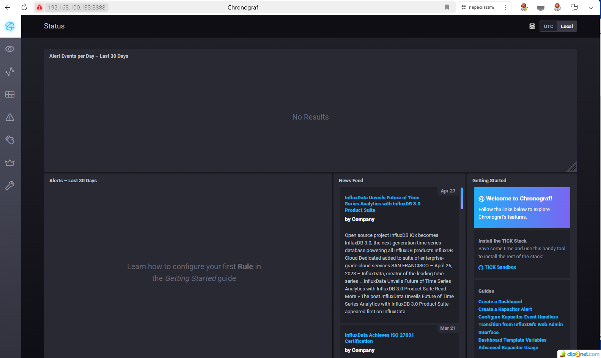
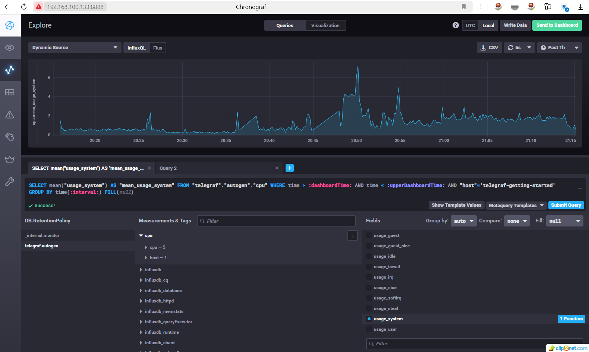
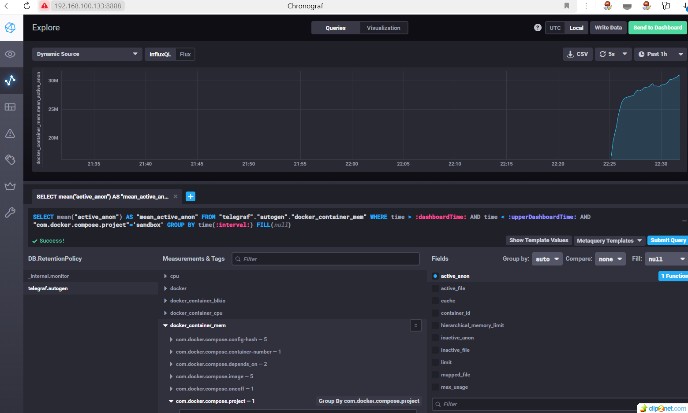

## Домашнее задание к занятию "13.Системы мониторинга"
 

#### 1. Вас пригласили настроить мониторинг на проект. На онбординге вам рассказали, что проект представляет из себя платформу для вычислений с выдачей текстовых отчетов, которые сохраняются на диск. Взаимодействие с платформой осуществляется по протоколу http. Также вам отметили, что вычисления загружают ЦПУ. Какой минимальный набор метрик вы выведите в мониторинг и почему?
* решение:
* a. проект представляет из себя платформу для вычислений с выдачей текстовых отчетов, которые сохраняются на диск, значит надо мониторить:
* свободное пространство на диске
* нагрузку на диск
* состояние диска
* b. вычисления загружают ЦПУ, мониторим:
* общую загрузку ЦПУ
* нагрузки на ЦПУ, которая оказывает непосредственно приложением проекта
* c. взаимодействие с платформой осуществляется по протоколу http, мониторим:
* количество (http) запросов к данному приложению
* количество неудачных ответов пользователям (ошибки 400/404)
* нагрузку на сеть, количество трафика

#### 2. Менеджер продукта посмотрев на ваши метрики сказал, что ему непонятно что такое RAM/inodes/CPUla. Также он сказал, что хочет понимать, насколько мы выполняем свои обязанности перед клиентами и какое качество обслуживания. Что вы можете ему предложить?
* решение:
* Следует утвердить SLA в рамках которого будут указаны SLO разных иных метрик, так будет проще ориентироваться в состоянии продукта. Нужно будет определять только разницы значений SLO и SLI. Если значения SLI метрик не противоречат установленным  SLO значит проект работает хорошо. Использование SLO, SLA и SLI в системе мониторинга поможет более точно измерять и контролировать качество обслуживания, предоставляя менеджеру продукта понятные и объективные данные.

#### 3. Вашей DevOps команде в этом году не выделили финансирование на построение системы сбора логов. Разработчики в свою очередь хотят видеть все ошибки, которые выдают их приложения. Какое решение вы можете предпринять в этой ситуации, чтобы разработчики получали ошибки приложения?
* решение:
* a. Можно использовать логирование в файлы. Разработчики могут реализовать логирование в текстовые файлы. Это простой и бесплатный способ записи информации об ошибках.
* b. Использование открытых решений, например Zabbix или Prometheus.

#### 4. Вы, как опытный SRE, сделали мониторинг, куда вывели отображения выполнения SLA=99% по http кодам ответов. Вычисляете этот параметр по следующей формуле: summ_2xx_requests/summ_all_requests. Данный параметр не поднимается выше 70%, но при этом в вашей системе нет кодов ответа 5xx и 4xx. Где у вас ошибка?
* решение:
* Вероятно игнорируются значения других кодов, например: 1xx и 3xx. Можно попробовать применить такую формулу расчета SLI = (summ_2xx_requests + summ_3xx_requests + summ_1xx_requests)/(summ_all_requests) Проанализировать результат.

#### 5. Опишите основные плюсы и минусы pull и push систем мониторинга.
* решение:
* Pull-системы пюсы.
* 1. Простота настройки: Pull-системы легче настраивать, так как агенты, собирающие данные, не требуют сложной конфигурации на стороне источника данных.
* 2. Меньший объем трафика: Агенты сами инициируют запросы на сбор данных, что может уменьшить объем сетевого трафика, по сравнению с постоянной передачей данных.
* 3. Гибкость в выборе источников данных: Можно легко добавлять новые источники данных, не изменяя конфигурацию центрального сервера.

* Pull-системы минусы.
* 1. Задержка в обновлении данных: Из-за того, что сбор данных происходит по инициативе агентов, возможна задержка в получении свежей информации.
* 2. Более высокие требования к ресурсам.

#### 6. Какие из ниже перечисленных систем относятся к push модели, а какие к pull? А может есть гибридные?
* Prometheus - гибридная
* TICK - Push
* Zabbix - гибридная
* VictoriaMetrics - гибридная
* Nagios - Pull
 
#### 7. Склонируйте себе репозиторий и запустите TICK-стэк, используя технологии docker и docker-compose. В виде решения на это упражнение приведите скриншот веб-интерфейса ПО chronograf (http://localhost:8888).
* решение

01: 

#### 8. Перейдите в веб-интерфейс Chronograf (http://localhost:8888) и откройте вкладку Data explorer.

Нажмите на кнопку Add a query
Изучите вывод интерфейса и выберите БД telegraf.autogen
В measurments выберите cpu->host->telegraf-getting-started, а в fields выберите usage_system. Внизу появится график утилизации cpu.
Вверху вы можете увидеть запрос, аналогичный SQL-синтаксису. Поэкспериментируйте с запросом, попробуйте изменить группировку и интервал наблюдений.
Для выполнения задания приведите скриншот с отображением метрик утилизации cpu из веб-интерфейса.

* решение

02: 

#### 9. Изучите список telegraf inputs. Добавьте в конфигурацию telegraf следующий плагин - docker:
[[inputs.docker]]
  endpoint = "unix:///var/run/docker.sock"
Дополнительно вам может потребоваться донастройка контейнера telegraf в docker-compose.yml дополнительного volume и режима privileged:

  telegraf:
    image: telegraf:1.4.0
    privileged: true
    volumes:
      - ./etc/telegraf.conf:/etc/telegraf/telegraf.conf:Z
      - /var/run/docker.sock:/var/run/docker.sock:Z
    links:
      - influxdb
    ports:
      - "8092:8092/udp"
      - "8094:8094"
      - "8125:8125/udp"
После настройке перезапустите telegraf, обновите веб интерфейс и приведите скриншотом список measurments в веб-интерфейсе базы telegraf.autogen . Там должны появиться метрики, связанные с docker.

* решение

03: 

## END