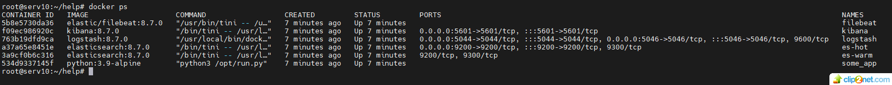
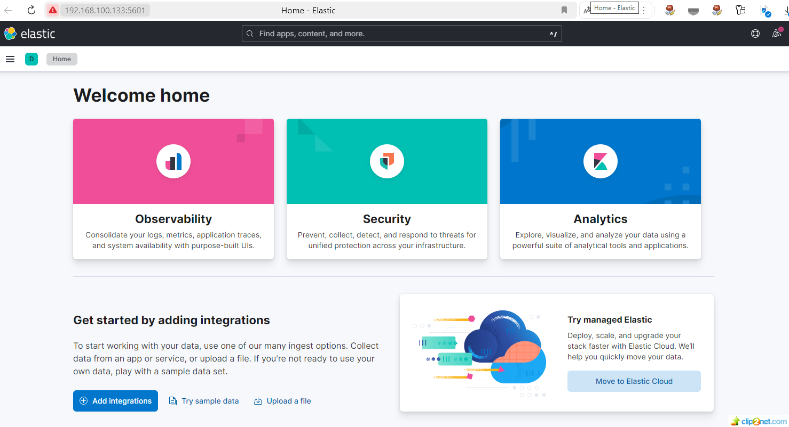
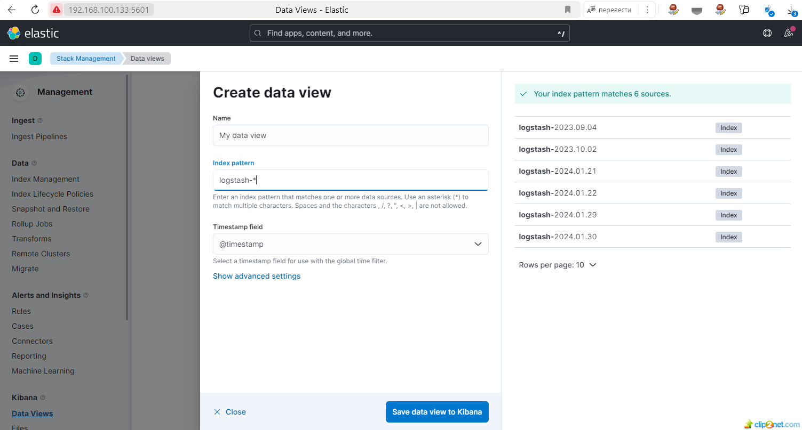
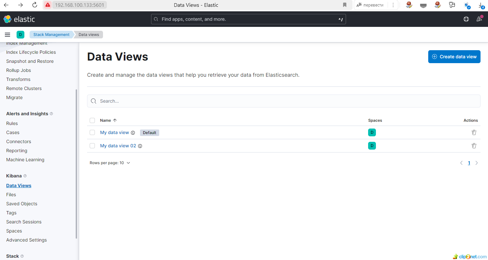
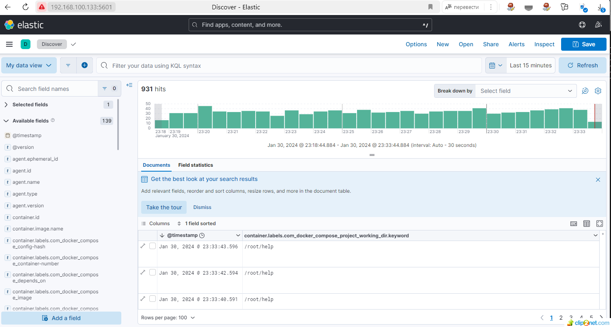

## Домашнее задание к занятию 15 «Система сбора логов Elastic Stack» 
 
#### Задание 1
Вам необходимо поднять в докере и связать между собой:

- elasticsearch (hot и warm ноды);
- logstash;
- kibana;
- filebeat.

Logstash следует сконфигурировать для приёма по tcp json-сообщений.

Filebeat следует сконфигурировать для отправки логов docker вашей системы в logstash.

В директории [help](./help) находится манифест docker-compose и конфигурации filebeat/logstash для быстрого выполнения этого задания.

Результатом выполнения задания должны быть:

- скриншот `docker ps` через 5 минут после старта всех контейнеров (их должно быть 5);
* решение

01: 

- скриншот интерфейса kibana;

* решение

02: 

#### Задание 2

- перейдите в меню создания index-patterns в kibana и создайте несколько index-patterns из имеющихся.
* решение

03: 

04: 

- Перейдите в меню просмотра логов в kibana (Discover) и самостоятельно изучите, как отображаются логи и как производить поиск по логам.

05: 

## END