## Тестовый коммит

## Домашнее задание к занятию «Введение в Terraform»

### Чек-лист готовности к домашнему заданию

#### Скачайте и установите актуальную версию Terraform >=1.4.X . Приложите скриншот вывода команды terraform --version.

* terraform_v: 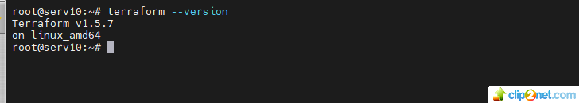

#### Скачайте на свой ПК этот git-репозиторий. Исходный код для выполнения задания расположен в директории 01/src.
#### Убедитесь, что в вашей ОС установлен docker.
* docker_v: 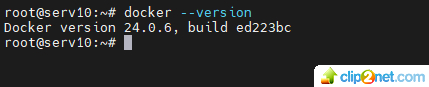
#### Зарегистрируйте аккаунт на сайте https://hub.docker.com/, выполните команду docker login и введите логин, пароль.

## Задание 1
### Перейдите в каталог src. Скачайте все необходимые зависимости, использованные в проекте.

### Изучите файл .gitignore. В каком terraform-файле, согласно этому .gitignore, допустимо сохранить личную, секретную информацию?

* рекшение:
* personal.auto.tfvars

### Выполните код проекта. Найдите в state-файле секретное содержимое созданного ресурса random_password, пришлите в качестве ответа конкретный ключ и его значение.
* random_password.png: 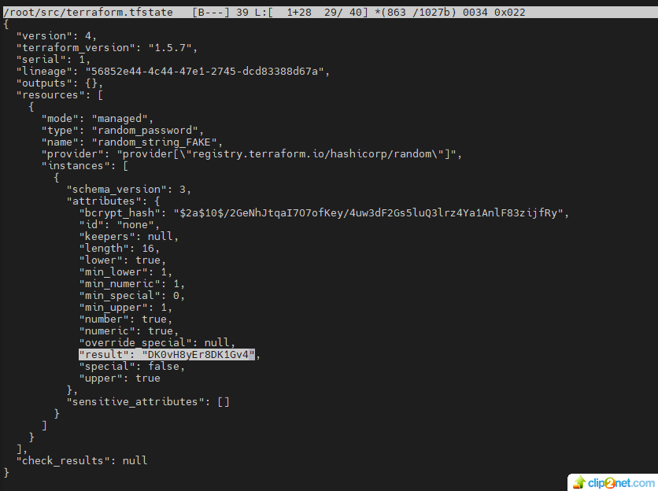

### Раскомментируйте блок кода, примерно расположенный на строчках 29–42 файла main.tf. Выполните команду terraform validate. Объясните, в чём заключаются намеренно допущенные ошибки. Исправьте их.
*   решение:
*    в блоке resource "docker_image тсутствует имя ресурса
*    в блоке resource "docker_container"  ошибка в имени ресурса - "1nginx"
*    в блоке resource "docker_container" ссылка на незадекларированный ресурс - random_string_FAKE 
*    в блоке resource "docker_container" неподдерживаемый атрибут - resulT

### Выполните код. В качестве ответа приложите: исправленный фрагмент кода и вывод команды docker ps.
* main.tf_01.png: 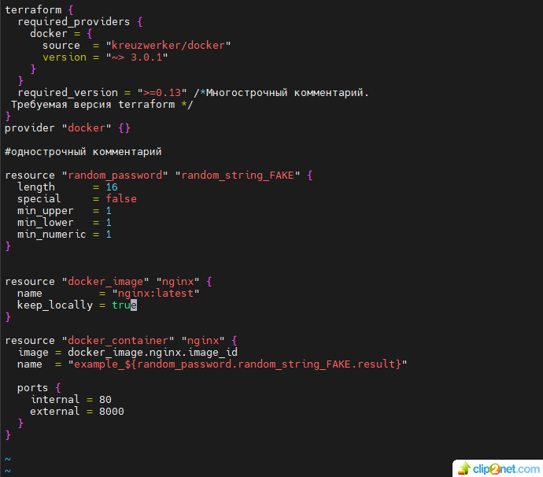

* docker_ps_01.png: 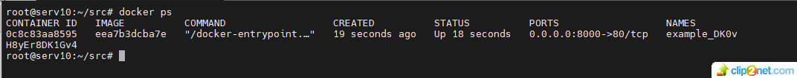

### Замените имя docker-контейнера в блоке кода на hello_world. Не перепутайте имя контейнера и имя образа. Мы всё ещё продолжаем использовать name = "nginx:latest". Выполните команду terraform apply -auto-approve. Объясните своими словами, в чём может быть опасность применения ключа -auto-approve. В качестве ответа дополнительно приложите вывод команды docker ps.
* решение:
* при использовании ключа -auto-approve, terraform начинает формировать инфраструктуру сразу, повышается вероятность ошибки

* docker_ps_02.png: 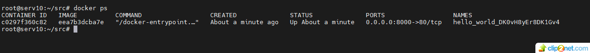

### Уничтожьте созданные ресурсы с помощью terraform. Убедитесь, что все ресурсы удалены. Приложите содержимое файла terraform.tfstate.
* tfstate_01.png: 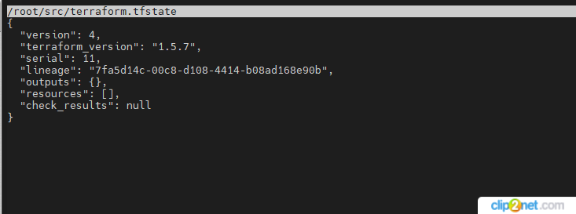

### Объясните, почему при этом не был удалён docker-образ nginx:latest. Ответ обязательно подкрепите строчкой из документации terraform провайдера docker. (ищите в классификаторе resource docker_image )
* решение:
* docker-образ nginx:latest не удалился потомучто в коде блока resource "docker_image" "nginx" использовали keep_locally = true
* Строка из документации terraform:
* keep_locally (Boolean) If true, then the Docker image won't be deleted on destroy operation. If this is false, it will delete the image from the docker local storage on destroy operation.

## END

## Домашнее задание к занятию 4. «Оркестрация группой Docker-контейнеров на примере Docker Compose»

### Задача 1
Создайте собственный образ любой операционной системы (например, debian-11) с помощью Packer версии 1.5.0 (инструкция).

Чтобы получить зачёт, вам нужно предоставить скриншот страницы с созданным образом из личного кабинета YandexCloud.

* yndex_image_debian: 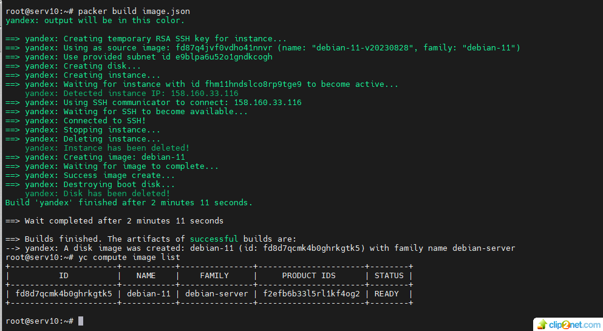

* yndex_image_debian_lk.png: 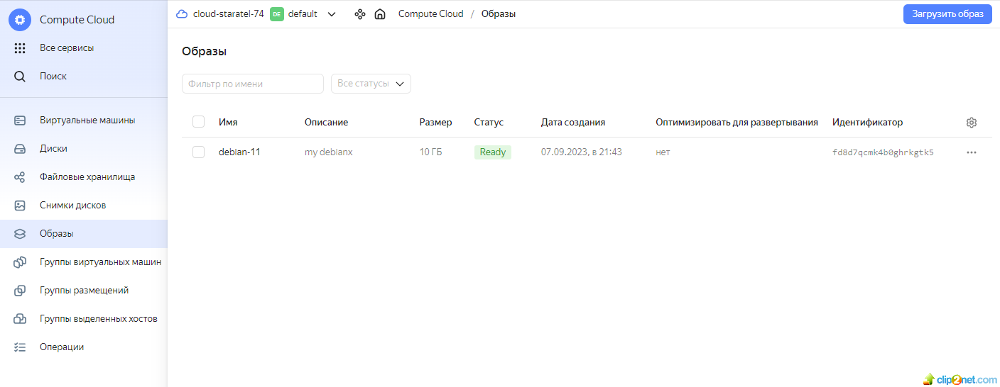

### Задача 2
2.1. Создайте вашу первую виртуальную машину в YandexCloud с помощью web-интерфейса YandexCloud.

Чтобы получить зачёт, вам нужно предоставить вывод команды terraform apply и страницы свойств, созданной ВМ из личного кабинета YandexCloud.

* yandex_centos-vm-01.png: 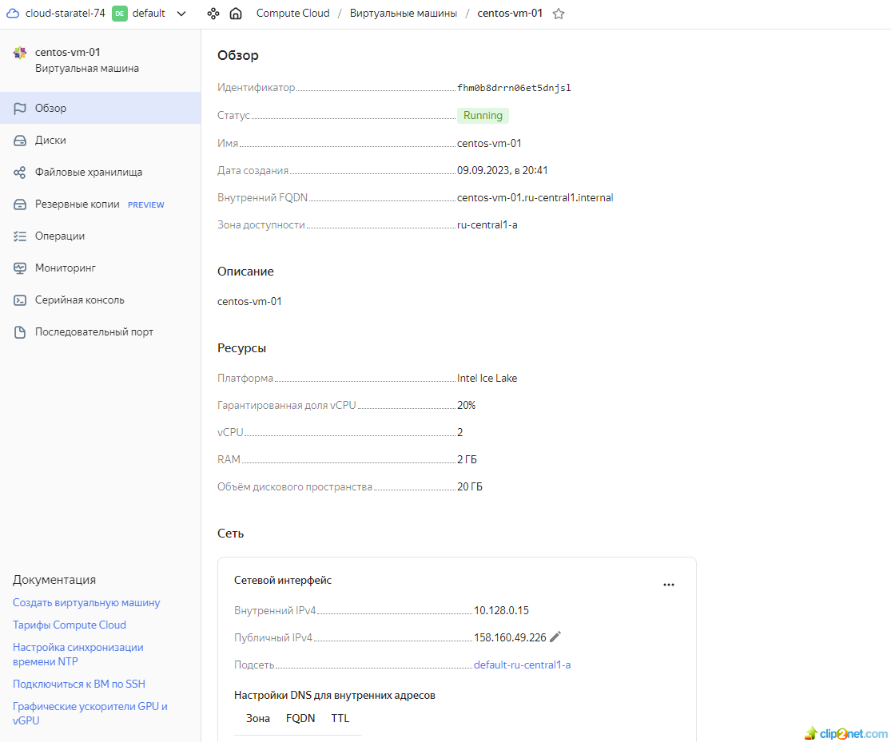

### Задача 3

С помощью Ansible и Docker Compose разверните на виртуальной машине из предыдущего задания систему мониторинга на основе Prometheus/Grafana. Используйте Ansible-код в директории (src/ansible).

Чтобы получить зачёт, вам нужно предоставить вывод команды "docker ps" , все контейнеры, описанные в docker-compose, должны быть в статусе "Up".

* ansible-playbook: 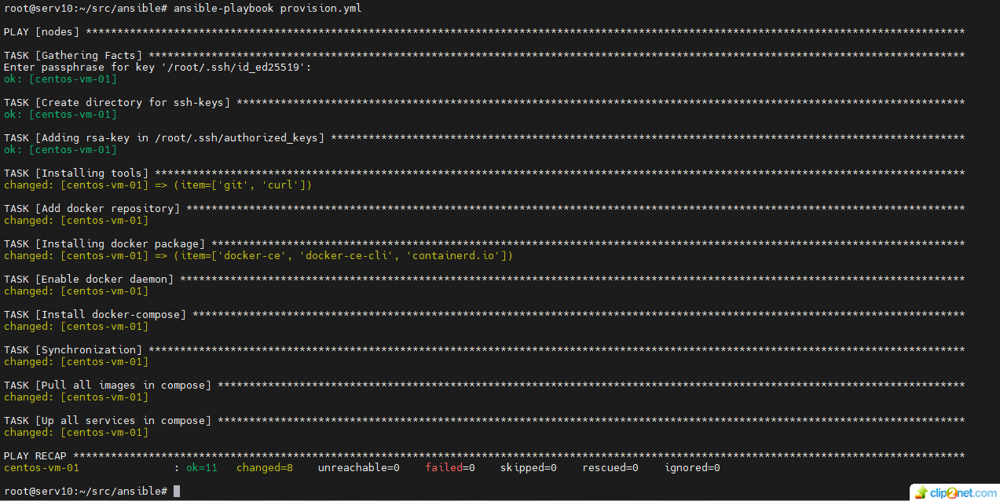

* centos-vm-01_docker_ps: 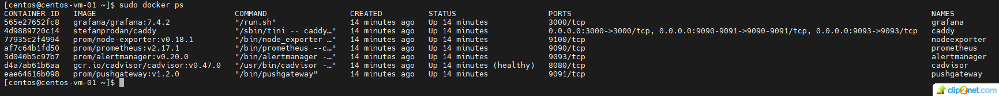

### Задача 4

Откройте веб-браузер, зайдите на страницу http://<внешний_ip_адрес_вашей_ВМ>:3000.
Используйте для авторизации логин и пароль из .env-file.
Изучите доступный интерфейс, найдите в интерфейсе автоматически созданные docker-compose-панели с графиками(dashboards).
Подождите 5-10 минут, чтобы система мониторинга успела накопить данные.
Чтобы получить зачёт, предоставьте:

скриншот работающего веб-интерфейса Grafana с текущими метриками, как на примере ниже.

* monitoring.png: 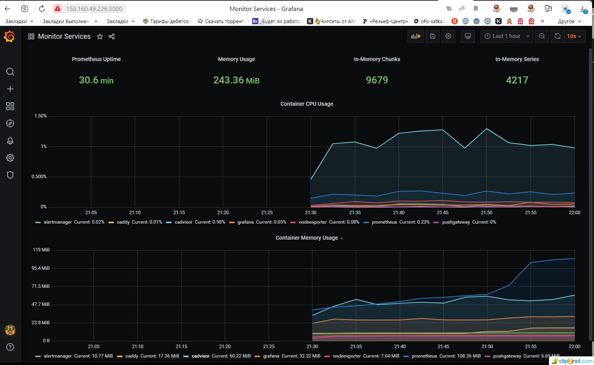

## END

## Доработка. Домашнее задание к занятию 3.

Какой, на ваш взгляд, метод работы систем кон-фигурации более надёжный - push или pull?
Сложно однозначно сказать, какой метод более надежен. Выбор метода зависит от конкретных задач.
...

* Представим что после начала запуска пайплайна у вас отвалился интернет...какой метод будет надежнее в этом случае?

Считается, что если надежность и устойчивость к сбоям более важны, pull-метод обычно является более приоритетным вариантом в случае отключения интернета.

Но если конфигурации уже загружены на целевые сервера и в процессе пайплана нет необходимости их менять, думаю, не принципиально какой метод используется в данной ситуации.

Если же необходимость изменений потребуется, то не сработает ни один метод, так как нет интернета между управляющим сервером и целевыми хостами.

## Домашнее задание к занятию 3. «Введение. Экосистема. Архитектура. Жизненный цикл Docker-контейнера»

### Задача 1

Опубликуйте созданный fork в своём репозитории и предоставьте ответ в виде ссылки 
https://hub.docker.com/repository/docker/staratel/my_nginx/general

### Задача 2
Посмотрите на сценарий ниже и ответьте на вопрос: 

«Подходит ли в этом сценарии использование Docker-контейнеров или лучше подойдёт виртуальная машина, физическая машина? Может быть, возможны разные варианты?»

Детально опишите и обоснуйте свой выбор.
* Сценарий:

высоконагруженное монолитное Java веб-приложение;
* Решение:

для высоконагруженных приложений, когда требуется максимальная производительность и контроль, подойдет физическая машина

* Сценарий:

Nodejs веб-приложение;

* Решение: 

использование Docker контейнеров, они обычно менее ресурсоемкие по сравнению с виртуальными машинами, что может сэкономить ресурсы и увеличить плотность размещения на сервере

* Сценарий:

мобильное приложение c версиями для Android и iOS;

* Решение: 

наиболее подходящим вариантом является использование виртуальных машин. Это обеспечивает изолированное и управляемое окружение для разработки и тестирования на обеих платформах.

* Сценарий:

шина данных на базе Apache Kafka;
* Решение:

Docker контейнеры могут быть использованы для Apache Kafka в тестовых или разработочных средах. Для продакшн-среды, где критически важны производительность, физические машины обычно являются более подходящими вариантами.

* Сценарий:

Elasticsearch-кластер для реализации логирования продуктивного веб-приложения — три ноды elasticsearch, два logstash и две ноды kibana;

* Решение:

Использование Docker контейнеров. Данная технология позволяет легко масштабировать и обслуживать Elasticsearch-кластер и предоставляет более гибкое и удобное решение для реализации логирования продуктивного веб-приложения.

* Сценарий:

мониторинг-стек на базе Prometheus и Grafana;

* Решение:

Использование Docker контейнеров обеспечивает более гибкий, портативный и управляемый способ развертывания и поддержки мониторинг-стека,  имеется много готовых образов, что упрощает развертывание Prometheus и Grafana.

* Сценарий:

MongoDB как основное хранилище данных для Java-приложения;

* Решение:

Наиболее предпочтительным вариантом будет использование виртуальной или физической машины, они обеспечивают лучшую производительность и стабильность.
* Сценарий:

Gitlab-сервер для реализации CI/CD-процессов и приватный (закрытый) Docker Registry.
* Решение:

Предпочтительнее использовать Docker контейнеры они предоставляют более гибкое, портативное и управляемое решение, которое легко масштабируется и обслуживается. Но могут быть применены и другие варианты.

### Задача 3
* Решение:

root@serv10:~# docker ps

CONTAINER ID   IMAGE     COMMAND       CREATED          STATUS          PORTS     NAMES

2204284a3b4b   debian    "bash"        18 minutes ago   Up 18 minutes             debian-my

bde6faf410e5   centos    "/bin/bash"   18 minutes ago   Up 18 minutes             centos-my

root@serv10:~# docker exec -it debian-my /bin/bash

root@2204284a3b4b:/# cd /data

root@2204284a3b4b:/data# ls -l

total 8

-rw-r--r-- 1 root root 8 Sep  4 18:32 cfg.txt

-rw-r--r-- 1 root root 6 Sep  4 18:43 cfg_02.txt

root@2204284a3b4b:/data#

### END.

## Домашнее задание к занятию 2. «Применение принципов IaaC в работе с виртуальными машинами»

### Задача 1
Опишите основные преимущества применения на практике IaaC-паттернов.

* Ускорение производства и вывода продукта на рынок
* Стабильность среды, устранение дрейфа конфигураций
* Более быстрая и эффективная разработка

Какой из принципов IaaC является основополагающим?

* Главное преимущество применения IaaC это – идемпотентность, свойство объекта или операции, при повторном выполнении которой мы получаем результат идентичный предыдущему и всем последующим.

### Задача 2
Чем Ansible выгодно отличается от других систем управление конфигурациями?

* Для работы не требуется установки специальных агентов на целевых хостах. Для связи использует протокол SSH. Быстрый старт на текущей SSH инфраструктуре, декларативный метод описания конфигураций, низкий порог входа. Написан на популярном языке Python.

Какой, на ваш взгляд, метод работы систем конфигурации более надёжный — push или pull?
* Сложно однозначно сказать, какой метод более надежен. Выбор метода зависит от конкретных задач. 

#### Push-метод:
Преимущества:
* Проще для старта и модификации инфраструктуры, изменения могут быть быстро применены на целевых серверах, что может быть полезным, если требуется быстро развернуть или обновить инфраструктуру. 

Недостатки:
* Необходимость мониторинга и запуска обновлений.
#### Pull-метод:
Преимущества:
* Конфигурация применяется на узлы непрерывно, что обеспечивает более актуальное состояние.

Недостатки:

* Сложнее в настройке, необходима настройка на стороне управляемых узлов для обработки обновлений.

### Задача 3
Установите на личный компьютер:

VirtualBox,
Vagrant,
Terraform,
Ansible.

Приложите вывод команд установленных версий каждой из программ, оформленный в Markdown.

staratel@serv10:~$ VBoxManage --version
6.1.38_Ubuntur153438
 
staratel@serv10:~$ vagrant --version
Vagrant 2.2.6

C:\Terraform>terraform -v
Terraform v1.5.6
on windows_amd64

staratel@serv10:~$ ansible --version
ansible 2.9.6

  config file = /etc/ansible/ansible.cfg

  configured module search path = ['/home/staratel/.ansible/plugins/modules', '/usr/share/ansible/plugins/modules']

  ansible python module location = /usr/lib/python3/dist-packages/ansible

  executable location = /usr/bin/ansible

  python version = 3.8.10 (default, May 26 2023, 14:05:08) [GCC 9.4.0]

### Задача 4
Воспроизведите практическую часть лекции самостоятельно.

Создайте виртуальную машину.

* VM_01: 
* VM_02: 

Зайдите внутрь ВМ, убедитесь, что Docker установлен

* Docker: 

### END.

## Домашнее задание к занятию 1. «Введение в виртуализацию. Типы и функции гипервизоров. Обзор рынка вендоров и областей применения»

#### Задача 1
Опишите кратко, в чём основное отличие полной (аппаратной) виртуализации, паравиртуализации и виртуализации на основе ОС.
#### Решение:
Для аппаратной виртуализации нет необходимости устанавливать на физический сервер хостовую ОС, её роль берет на себя гипервизор. Гостевые ОС работают напрямую с центральным процессором, что повышает производительность.
Для паравиртуализации гипервизорам данного типа необходима хостовая ОС. Он модифицирует ядро гостевых ОС для разделения доступа к аппаратным ресурсам физического сервера.
Виртуализация уровня ОС позволяет запускать изолированные виртуальные машины на одном физическом сервере с гостевыми ОС только такого же типа, как и хостовая ОС, которая берет на себя роль гипервизора. Такие VM называют контейнерами.
#### Задача 2
Выберите один из вариантов использования организации физических серверов в зависимости от условий использования.

Организация серверов:
1.	физические сервера,
2.	паравиртуализация,
3.	виртуализация уровня ОС.

Условия использования:
1.  высоконагруженная база данных, чувствительная к отказу;
2.	различные web-приложения;
3.	Windows-системы для использования бухгалтерским отделом;
4. 	системы, выполняющие высокопроизводительные расчёты на GPU.

Опишите, почему вы выбрали к каждому целевому использованию такую организацию.
#### Решение:
1.	Высоконагруженная база данных, чувствительная к отказу – необходимо использовать физические сервера с реализованными RAID массивами, кластеризацией или другими системами резервирования.
2.	Если требуется запускать различные web-приложения которые написаны для разных ОС, то необходимо использовать паравиртуализацию. Такая организация позволить установить VM с необходимыми гостевыми ОС для приложений.
3.	Windows-системы для использования бухгалтерским отделом - Так как будут использоваться однотипные ОС, можно применить виртуализацию уровня ОС, что обеспечит изолированную работу гостевых ОС и хорошую производительность.
4.	системы, выполняющие высокопроизводительные расчёты на GPU - физические сервера. Данная организация обеспечит максимальную производительность.

#### Задача 3
Выберите подходящую систему управления виртуализацией для предложенного сценария. Детально опишите ваш выбор.
#### Сценарий:
100 виртуальных машин на базе Linux и Windows, общие задачи, нет особых требований. Преимущественно Windows based инфраструктура, требуется реализация программных балансировщиков нагрузки, репликации данных и автоматизированного механизма создания резервных копий.
#### Решение:
Данную задачу можно решить с помощью продуктов от компании VMWare. В них реализована поддержка Windows и Linux виртуальных машин, есть балансировка нагрузки, репликация данных и автоматизированный механизм создания резервных копий.
#### Сценарий:
Требуется наиболее производительное бесплатное open source решение для виртуализации небольшой (20-30 серверов) инфраструктуры на базе Linux и Windows виртуальных машин.
#### Решение:
Xen поддерживает разнообразные операционные системы, включая различные варианты Linux и Windows Это бесплатное программное решение, позволяет достичь высокой производительности.
#### Сценарий:
Необходимо бесплатное, максимально совместимое и производительное решение для виртуализации Windows инфраструктуры.
#### Решение:
Hyper-V Server является бесплатным продуктом от компании Microsoft. Имеет хорошую производительность и максимальную совместимость с windows системами.
#### Сценарий:
Необходимо рабочее окружение для тестирования программного продукта на нескольких дистрибутивах Linux.
Решение:
KVM. Нативная для большинства современных ядер Linux. Имеет хорошую производительность.
#### Задача 4
Опишите возможные проблемы и недостатки гетерогенной среды виртуализации (использования нескольких систем управления виртуализацией одновременно) и что необходимо сделать для минимизации этих рисков и проблем. Если бы у вас был выбор, создавали бы вы гетерогенную среду или нет? Мотивируйте ваш ответ примерами.
#### Решение:
1.	В гетерогенной среде требуется управлять разнообразными технологиями виртуализации. Это повышает сложность администрирования, мониторинга и обслуживания инфраструктуры.
2.	Администраторы и инженеры должны быть знакомы с разными технологиями виртуализации по этому повышаются затраты на обучение персонала, также возможно потребуются дополнительные затраты на лицензии ПО и оборудование.
3.	Различные виртуализационные технологии могут быть несовместимыми между собой или требовать дополнительной конфигурации для взаимодействия. Как следствие усложняется перенос приложений и данных между разными технологиями виртуализации.
4.	В гетерогенной среде виртуализации повышаются риски безопасности. Уязвимости в одной технологии могут повлиять на другие компоненты системы. Сложность управления безопасностью увеличивает вероятность ошибок.

Путем тщательного планирования, автоматизации, обучения персонала и акцентирования на безопасности можно уменьшить риски и сложности, связанные с гетерогенной средой виртуализации.

Необходимо убедиться, что одна система виртуализации полностью не решает поставленные задачи. Только в этом случае применять гетерогенную среду.

Предположим, предприятие решает использовать виртуальные машины (VM) и контейнеры.
Виртуальные машины и контейнеры имеют разные способы управления. Компания столкнётся с проблемой сложного администрирования и мониторинга из-за несовместимости и различий в управлении. Придется обучать специалистов разным технологиям или нанимать новых, что повышает затраты на содержание ИТ инфраструктуры.

### END.

### change number 1
### change number 2
### change number 3

# Local .terraform directories
**/.terraform/*		- игнорировать все файлы и папки в директории .terraform, которая может лежать в любом месте репозотория 

# .tfstate files
*.tfstate			- игнорировать все файлы с расширением .tfstate
*.tfstate.*			- игнорировать все файлы, которые в своем имени имеют символы .tfstate. 

# Crash log files
crash.log			- игнорировать все файлы с таким именем
crash.*.log			- игнорировать все файлы, которые начинаются на crash. и заканчиваются на .log 

# Exclude all .tfvars files, which are likely to contain sensitive data, such as
# password, private keys, and other secrets. These should not be part of version 
# control as they are data points which are potentially sensitive and subject 
# to change depending on the environment.
*.tfvars			- игнорировать все файлы с расширением .tfvars
*.tfvars.json		- игнорировать все файлы, заканчивающиеся символами .tfvars.json

# Ignore override files as they are usually used to override resources locally and so
# are not checked in
override.tf			- игнорировать все файлы с таким именем
override.tf.json	- игнорировать все файлы с таким именем
*_override.tf		- игнорировать все файлы, заканчивающиеся символами _override.tf
*_override.tf.json	- игнорировать все файлы, заканчивающиеся символами _override.tf.json

# Include override files you do wish to add to version control using negated pattern
# !example_override.tf

# Include tfplan files to ignore the plan output of command: terraform plan -out=tfplan
# example: *tfplan*

# Ignore CLI configuration files
.terraformrc			- игнорировать все файлы с таким именем
terraform.rc			- игнорировать все файлы с таким именем