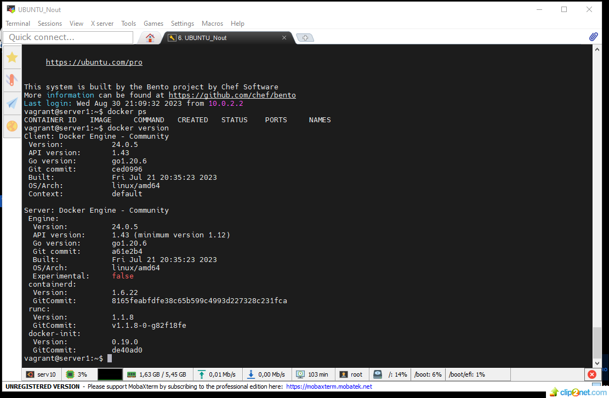

## Домашнее задание к занятию 2. «Применение принципов IaaC в работе с виртуальными машинами»

### Задача 1
Опишите основные преимущества применения на практике IaaC-паттернов.

* Ускорение производства и вывода продукта на рынок
* Стабильность среды, устранение дрейфа конфигураций
* Более быстрая и эффективная разработка

Какой из принципов IaaC является основополагающим?

* Главное преимущество применения IaaC это – идемпотентность, свойство объекта или операции, при повторном выполнении которой мы получаем результат идентичный предыдущему и всем последующим.

### Задача 2
Чем Ansible выгодно отличается от других систем управление конфигурациями?

* Для работы не требуется установки специальных агентов на целевых хостах. Для связи использует протокол SSH. Быстрый старт на текущей SSH инфраструктуре, декларативный метод описания конфигураций, низкий порог входа. Написан на популярном языке Python.

Какой, на ваш взгляд, метод работы систем конфигурации более надёжный — push или pull?
* Сложно однозначно сказать, какой метод более надежен. Выбор метода зависит от конкретных задач. 

#### Push-метод:
Преимущества:
* Проще для старта и модификации инфраструктуры, изменения могут быть быстро применены на целевых серверах, что может быть полезным, если требуется быстро развернуть или обновить инфраструктуру. 

Недостатки:
* Необходимость мониторинга и запуска обновлений.
#### Pull-метод:
Преимущества:
* Конфигурация применяется на узлы непрерывно, что обеспечивает более актуальное состояние.

Недостатки:

* Сложнее в настройке, необходима настройка на стороне управляемых узлов для обработки обновлений.

### Задача 3
Установите на личный компьютер:

VirtualBox,
Vagrant,
Terraform,
Ansible.

Приложите вывод команд установленных версий каждой из программ, оформленный в Markdown.

staratel@serv10:~$ VBoxManage --version
6.1.38_Ubuntur153438
 
staratel@serv10:~$ vagrant --version
Vagrant 2.2.6

C:\Terraform>terraform -v
Terraform v1.5.6
on windows_amd64

staratel@serv10:~$ ansible --version
ansible 2.9.6

  config file = /etc/ansible/ansible.cfg

  configured module search path = ['/home/staratel/.ansible/plugins/modules', '/usr/share/ansible/plugins/modules']

  ansible python module location = /usr/lib/python3/dist-packages/ansible

  executable location = /usr/bin/ansible

  python version = 3.8.10 (default, May 26 2023, 14:05:08) [GCC 9.4.0]

### Задача 4
Воспроизведите практическую часть лекции самостоятельно.

Создайте виртуальную машину.

* VM_01: 
* VM_02: 

Зайдите внутрь ВМ, убедитесь, что Docker установлен

* Docker: 

### END.

## Домашнее задание к занятию 1. «Введение в виртуализацию. Типы и функции гипервизоров. Обзор рынка вендоров и областей применения»

#### Задача 1
Опишите кратко, в чём основное отличие полной (аппаратной) виртуализации, паравиртуализации и виртуализации на основе ОС.
#### Решение:
Для аппаратной виртуализации нет необходимости устанавливать на физический сервер хостовую ОС, её роль берет на себя гипервизор. Гостевые ОС работают напрямую с центральным процессором, что повышает производительность.
Для паравиртуализации гипервизорам данного типа необходима хостовая ОС. Он модифицирует ядро гостевых ОС для разделения доступа к аппаратным ресурсам физического сервера.
Виртуализация уровня ОС позволяет запускать изолированные виртуальные машины на одном физическом сервере с гостевыми ОС только такого же типа, как и хостовая ОС, которая берет на себя роль гипервизора. Такие VM называют контейнерами.
#### Задача 2
Выберите один из вариантов использования организации физических серверов в зависимости от условий использования.

Организация серверов:
1.	физические сервера,
2.	паравиртуализация,
3.	виртуализация уровня ОС.

Условия использования:
1.  высоконагруженная база данных, чувствительная к отказу;
2.	различные web-приложения;
3.	Windows-системы для использования бухгалтерским отделом;
4. 	системы, выполняющие высокопроизводительные расчёты на GPU.

Опишите, почему вы выбрали к каждому целевому использованию такую организацию.
#### Решение:
1.	Высоконагруженная база данных, чувствительная к отказу – необходимо использовать физические сервера с реализованными RAID массивами, кластеризацией или другими системами резервирования.
2.	Если требуется запускать различные web-приложения которые написаны для разных ОС, то необходимо использовать паравиртуализацию. Такая организация позволить установить VM с необходимыми гостевыми ОС для приложений.
3.	Windows-системы для использования бухгалтерским отделом - Так как будут использоваться однотипные ОС, можно применить виртуализацию уровня ОС, что обеспечит изолированную работу гостевых ОС и хорошую производительность.
4.	системы, выполняющие высокопроизводительные расчёты на GPU - физические сервера. Данная организация обеспечит максимальную производительность.

#### Задача 3
Выберите подходящую систему управления виртуализацией для предложенного сценария. Детально опишите ваш выбор.
#### Сценарий:
100 виртуальных машин на базе Linux и Windows, общие задачи, нет особых требований. Преимущественно Windows based инфраструктура, требуется реализация программных балансировщиков нагрузки, репликации данных и автоматизированного механизма создания резервных копий.
#### Решение:
Данную задачу можно решить с помощью продуктов от компании VMWare. В них реализована поддержка Windows и Linux виртуальных машин, есть балансировка нагрузки, репликация данных и автоматизированный механизм создания резервных копий.
#### Сценарий:
Требуется наиболее производительное бесплатное open source решение для виртуализации небольшой (20-30 серверов) инфраструктуры на базе Linux и Windows виртуальных машин.
#### Решение:
Xen поддерживает разнообразные операционные системы, включая различные варианты Linux и Windows Это бесплатное программное решение, позволяет достичь высокой производительности.
#### Сценарий:
Необходимо бесплатное, максимально совместимое и производительное решение для виртуализации Windows инфраструктуры.
#### Решение:
Hyper-V Server является бесплатным продуктом от компании Microsoft. Имеет хорошую производительность и максимальную совместимость с windows системами.
#### Сценарий:
Необходимо рабочее окружение для тестирования программного продукта на нескольких дистрибутивах Linux.
Решение:
KVM. Нативная для большинства современных ядер Linux. Имеет хорошую производительность.
#### Задача 4
Опишите возможные проблемы и недостатки гетерогенной среды виртуализации (использования нескольких систем управления виртуализацией одновременно) и что необходимо сделать для минимизации этих рисков и проблем. Если бы у вас был выбор, создавали бы вы гетерогенную среду или нет? Мотивируйте ваш ответ примерами.
#### Решение:
1.	В гетерогенной среде требуется управлять разнообразными технологиями виртуализации. Это повышает сложность администрирования, мониторинга и обслуживания инфраструктуры.
2.	Администраторы и инженеры должны быть знакомы с разными технологиями виртуализации по этому повышаются затраты на обучение персонала, также возможно потребуются дополнительные затраты на лицензии ПО и оборудование.
3.	Различные виртуализационные технологии могут быть несовместимыми между собой или требовать дополнительной конфигурации для взаимодействия. Как следствие усложняется перенос приложений и данных между разными технологиями виртуализации.
4.	В гетерогенной среде виртуализации повышаются риски безопасности. Уязвимости в одной технологии могут повлиять на другие компоненты системы. Сложность управления безопасностью увеличивает вероятность ошибок.

Путем тщательного планирования, автоматизации, обучения персонала и акцентирования на безопасности можно уменьшить риски и сложности, связанные с гетерогенной средой виртуализации.

Необходимо убедиться, что одна система виртуализации полностью не решает поставленные задачи. Только в этом случае применять гетерогенную среду.

Предположим, предприятие решает использовать виртуальные машины (VM) и контейнеры.
Виртуальные машины и контейнеры имеют разные способы управления. Компания столкнётся с проблемой сложного администрирования и мониторинга из-за несовместимости и различий в управлении. Придется обучать специалистов разным технологиям или нанимать новых, что повышает затраты на содержание ИТ инфраструктуры.

### END.

### change number 1
### change number 2
### change number 3

# Local .terraform directories
**/.terraform/*		- игнорировать все файлы и папки в директории .terraform, которая может лежать в любом месте репозотория 

# .tfstate files
*.tfstate			- игнорировать все файлы с расширением .tfstate
*.tfstate.*			- игнорировать все файлы, которые в своем имени имеют символы .tfstate. 

# Crash log files
crash.log			- игнорировать все файлы с таким именем
crash.*.log			- игнорировать все файлы, которые начинаются на crash. и заканчиваются на .log 

# Exclude all .tfvars files, which are likely to contain sensitive data, such as
# password, private keys, and other secrets. These should not be part of version 
# control as they are data points which are potentially sensitive and subject 
# to change depending on the environment.
*.tfvars			- игнорировать все файлы с расширением .tfvars
*.tfvars.json		- игнорировать все файлы, заканчивающиеся символами .tfvars.json

# Ignore override files as they are usually used to override resources locally and so
# are not checked in
override.tf			- игнорировать все файлы с таким именем
override.tf.json	- игнорировать все файлы с таким именем
*_override.tf		- игнорировать все файлы, заканчивающиеся символами _override.tf
*_override.tf.json	- игнорировать все файлы, заканчивающиеся символами _override.tf.json

# Include override files you do wish to add to version control using negated pattern
# !example_override.tf

# Include tfplan files to ignore the plan output of command: terraform plan -out=tfplan
# example: *tfplan*

# Ignore CLI configuration files
.terraformrc			- игнорировать все файлы с таким именем
terraform.rc			- игнорировать все файлы с таким именем