## Домашнее задание к занятию «Основы Terraform. Yandex Cloud»
## Задание 1

#### Изучите проект. В файле variables.tf объявлены переменные для Yandex provider.
#### Переименуйте файл personal.auto.tfvars_example в personal.auto.tfvars. Заполните переменные: идентификаторы облака, токен доступа. Благодаря .gitignore этот файл не попадёт в публичный репозиторий. Вы можете выбрать иной способ безопасно передать секретные данные в terraform.
#### Сгенерируйте или используйте свой текущий ssh-ключ. Запишите его открытую часть в переменную vms_ssh_root_key.
#### Инициализируйте проект, выполните код. Исправьте намеренно допущенные синтаксические ошибки. Ищите внимательно, посимвольно. Ответьте, в чём заключается их суть.
* решение
* Опечатка в platform_id = "standart-v4" Данной платформы не существует. Есть платформа - standard-v3
* Для платформы standard-v3 параметр cores = 1 (количество ядер) не допустим; Можно использовать 2, 4, 6, 8 - 96 согласно документации, зависит от уровня производительности (core_fraction) и RAM на ядро.
* Для платформы standard-v3 параметр core_fraction = 5 (уровень производительности) не допустим. Можно использовать 20, 50,100
#### Ответьте, как в процессе обучения могут пригодиться параметры preemptible = true и core_fraction=5 в параметрах ВМ. Ответ в документации Yandex Cloud.
* решение 
* preemptible - Прерываемые виртуальные машины — это виртуальные машины, которые могут быть принудительно остановлены в любой момент.
    Прерываемые виртуальные машины доступны по более низкой цене. Удобный вариант для тренировки.
* core_fraction - уровень производительности vCPU. Для обучения высокий и дорогой core_fraction не нужен. При создании VM выбираем минимальный. 

### В качестве решения приложите:

* скриншот ЛК Yandex Cloud с созданной ВМ;

VM_01: 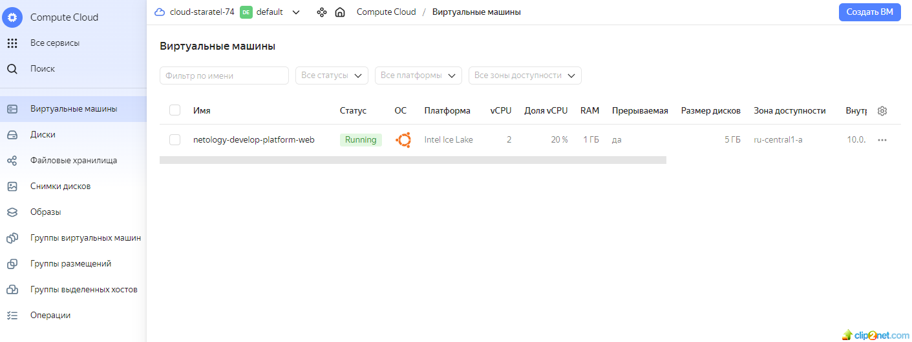
* скриншот успешного подключения к консоли ВМ через ssh. К OS ubuntu необходимо подключаться под пользователем ubuntu: "ssh ubuntu@vm_ip_address";

VM_02: 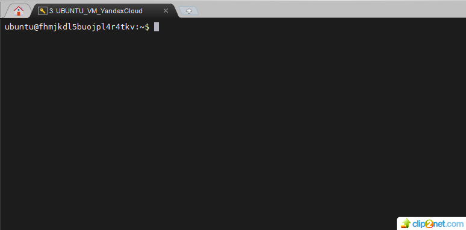

## Задание 2
#### Изучите файлы проекта.
#### Замените все хардкод-значения для ресурсов yandex_compute_image и yandex_compute_instance на отдельные переменные. К названиям переменных ВМ добавьте в начало префикс vm_web_ . Пример: vm_web_name.
#### Объявите нужные переменные в файле variables.tf, обязательно указывайте тип переменной. Заполните их default прежними значениями из main.tf.
#### Проверьте terraform plan. Изменений быть не должно.
* решение

terraform_plan_01: 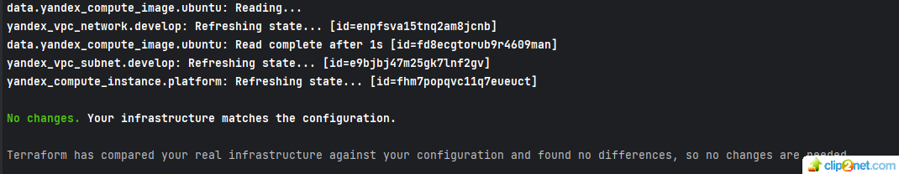

variables_01: 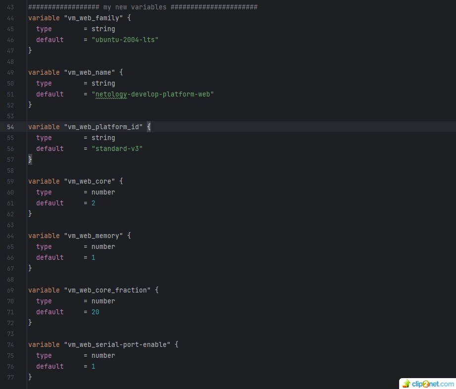

maintf_01: 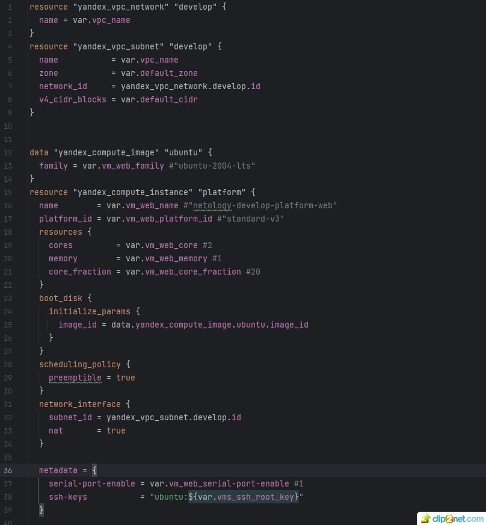

## Задание 3
#### Создайте в корне проекта файл 'vms_platform.tf' . Перенесите в него все переменные первой ВМ.
#### Скопируйте блок ресурса и создайте с его помощью вторую ВМ в файле main.tf: "netology-develop-platform-db" , cores = 2, memory = 2, core_fraction = 20. Объявите её переменные с префиксом vm_db_ в том же файле ('vms_platform.tf').
#### Примените изменения.

* решение 
VM_03: 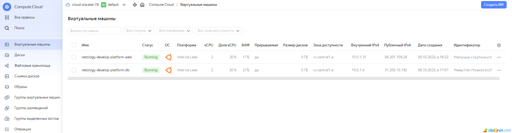

## Задание 4
#### Объявите в файле outputs.tf output типа map, содержащий { instance_name = external_ip } для каждой из ВМ.
#### Примените изменения.
#### В качестве решения приложите вывод значений ip-адресов команды terraform output.
terraform_output_01: 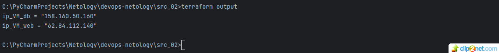

## Задание 5
#### В файле locals.tf опишите в одном local-блоке имя каждой ВМ, используйте интерполяцию ${..} с несколькими переменными по примеру из лекции.
* решение

locals_01: 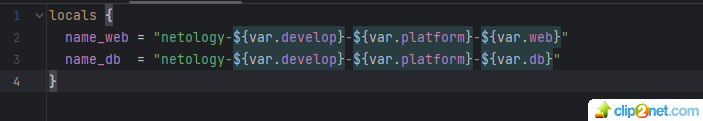

#### Замените переменные с именами ВМ из файла variables.tf на созданные вами local-переменные.
* решение для ВМ_1

VM_name_01: 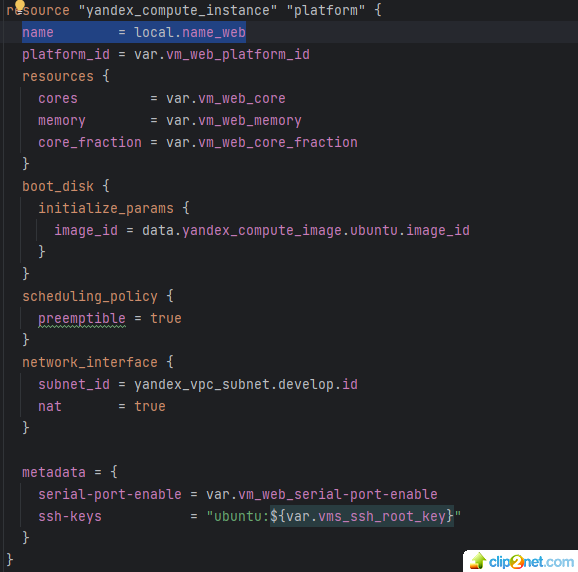

* решение для ВМ_2

VM_name_02: 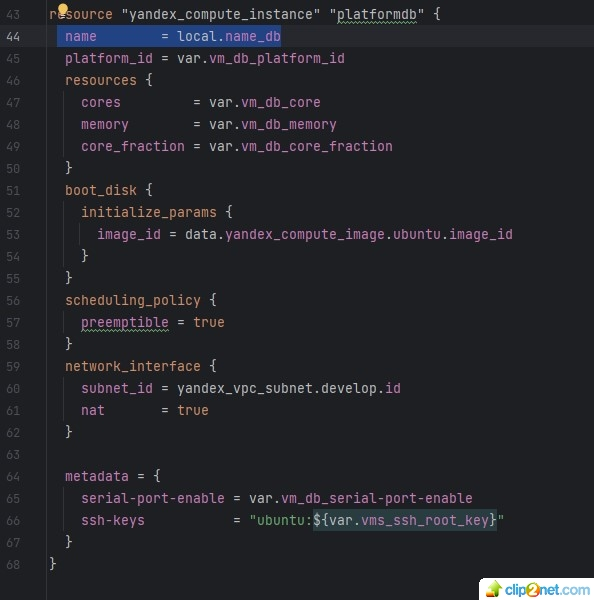

#### Примените изменения.

## Задание 6
#### Вместо использования трёх переменных ".._cores",".._memory",".._core_fraction" в блоке resources {...}, объедините их в переменные типа map с именами "vm_web_resources" и "vm_db_resources".
* решение для "vm_web_resources"
* объявляем переменную:

vm_web_resources: 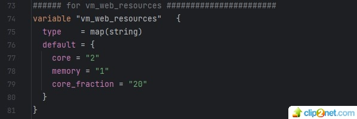

* заносим в main.tf

maintf_02: 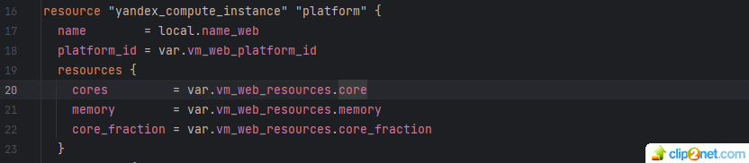

* решение для "vm_db_resources"
* объявляем переменную:

vm_db_resources: 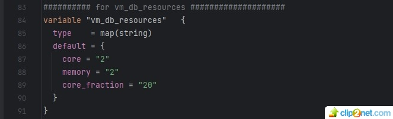

* заносим в main.tf

maintf_03: 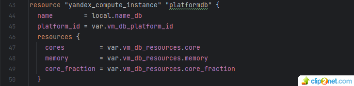

#### В качестве продвинутой практики попробуйте создать одну map-переменную vms_resources и уже внутри неё конфиги обеих ВМ — вложенный map.
* решение для "vms_resources"
* объявляем переменную:

vms_resources: 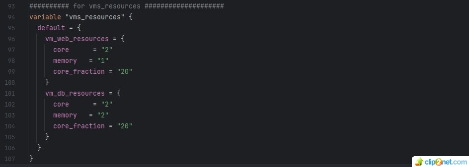

#### Также поступите с блоком metadata {serial-port-enable, ssh-keys}, эта переменная должна быть общая для всех ваших ВМ.
* решение
* объявляем переменную:

metadata_all: 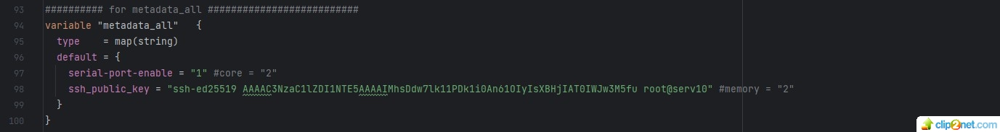

* заносим в main.tf, блок будет одинаковый для обеих ВМ

maintf_04: 

#### Найдите и удалите все более не используемые переменные проекта.
* ссылки на код (не используемые переменные закомментарил, чтобы видно было какие не используются)
* https://github.com/staratel74/PythonBasic/blob/main/vms_platform.tf
* 
#### Проверьте terraform plan. Изменений быть не должно.

terraform_plan_02: 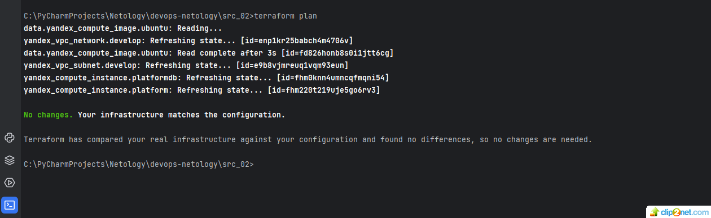

## END

 

