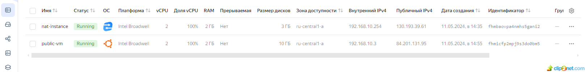

## Домашнее задание к занятию «Организация сети» 

### Задание 1. Yandex Cloud 
#### Что нужно сделать

1. Создать пустую VPC. Выбрать зону.
2. Публичная подсеть.

* Создать в VPC subnet с названием public, сетью 192.168.10.0/24.
* решение:
* 01: 
* 02: 
* Создать в этой подсети NAT-инстанс, присвоив ему адрес 192.168.10.254. В качестве image_id использовать fd80mrhj8fl2oe87o4e1.
* решение:
* 03: 
* 04: 
* Создать в этой публичной подсети виртуалку с публичным IP, подключиться к ней и убедиться, что есть доступ к интернету.
* решение:
* 05: 
* 06: 
* 07: 

3. Приватная подсеть.

* Создать в VPC subnet с названием private, сетью 192.168.20.0/24.
* решение:
* 08: 
* 09: 
* Создать route table. Добавить статический маршрут, направляющий весь исходящий трафик private сети в NAT-инстанс.
* решение:
* 10: 
* 11: 
* Создать в этой приватной подсети виртуалку с внутренним IP, подключиться к ней через виртуалку, созданную ранее, и убедиться, что есть доступ к интернету.
* решение:
* 12: 
* 13: 

* ссылка на maim.tf - https://github.com/staratel74/devops-netology/blob/main/cloud_project/Task_01/src/main.tf
* ссылка на variables.tf - https://github.com/staratel74/devops-netology/blob/main/cloud_project/Task_01/src/variables.tf
## END