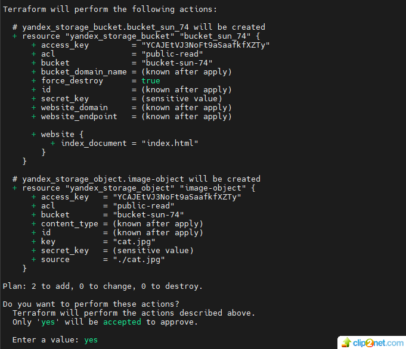
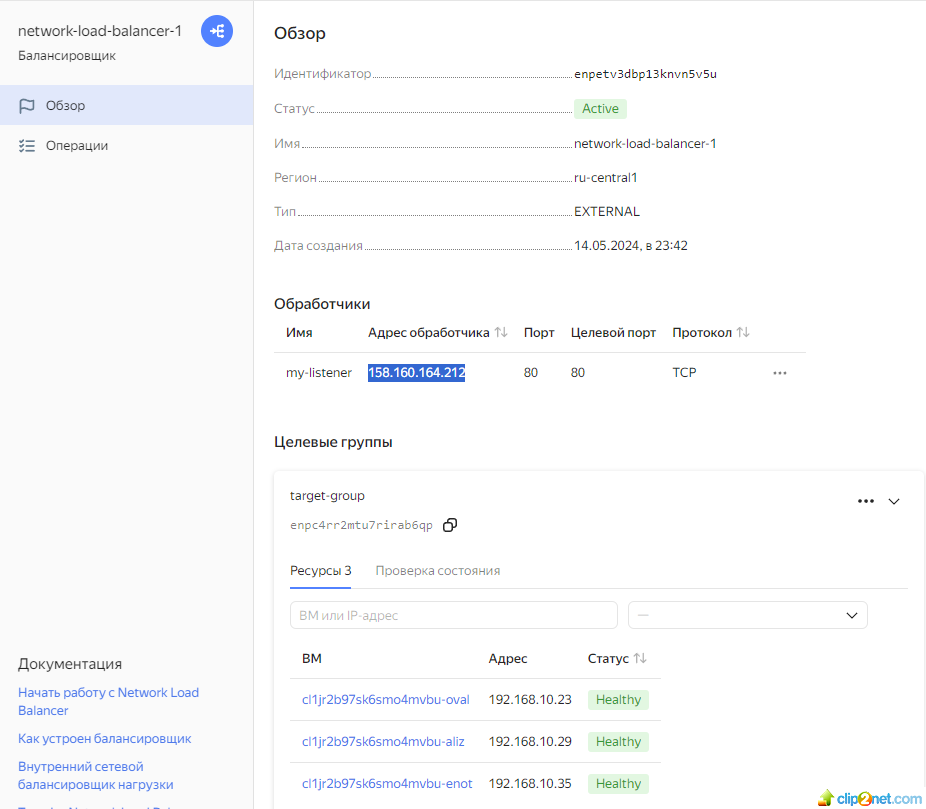
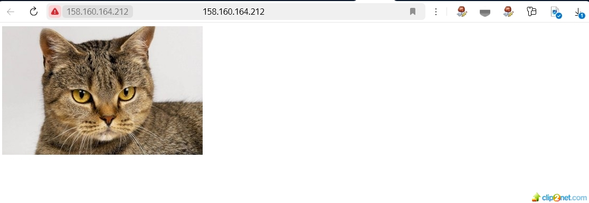
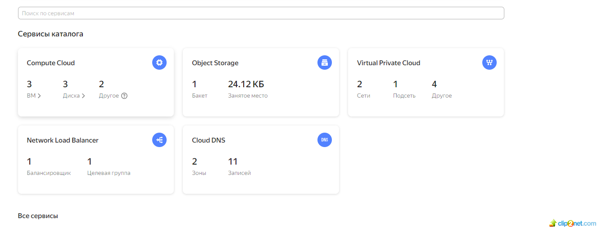
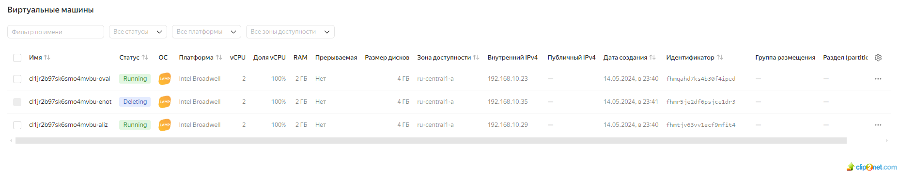
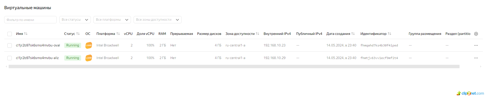
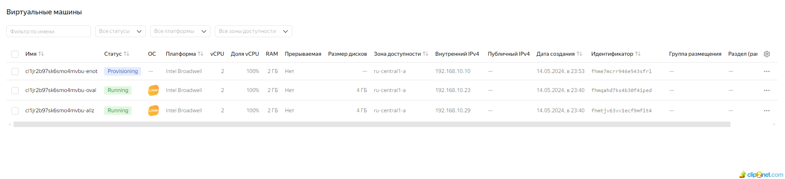
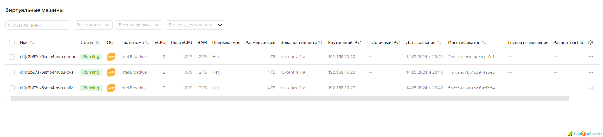
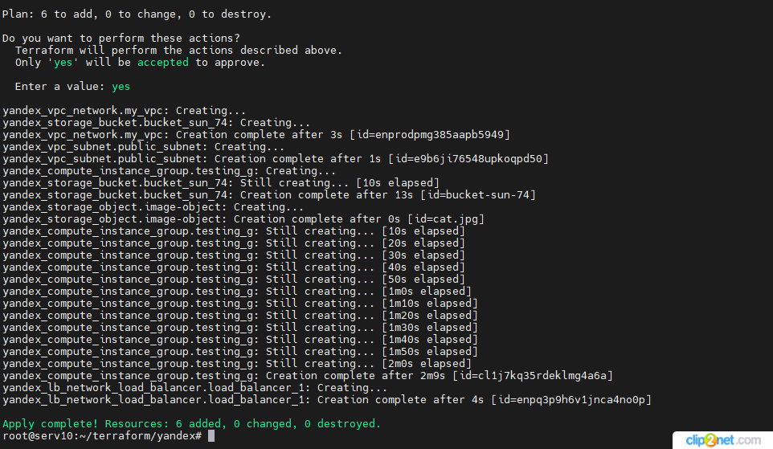

## Домашнее задание к занятию «Вычислительные мощности. Балансировщики нагрузки» 

### Задание 1. Yandex Cloud 
#### Что нужно сделать

1. Создать бакет Object Storage и разместить в нём файл с картинкой:
* Создать бакет в Object Storage с произвольным именем (например, имя_студента_дата).
* Положить в бакет файл с картинкой.
* Сделать файл доступным из интернета.
* решение:
* 01: 
* 02: 
2. Создать группу ВМ в public подсети фиксированного размера с шаблоном LAMP и веб-страницей, содержащей ссылку на картинку из бакета:
* Создать Instance Group с тремя ВМ и шаблоном LAMP. Для LAMP рекомендуется использовать image_id = fd827b91d99psvq5fjit.
* Для создания стартовой веб-страницы рекомендуется использовать раздел user_data в meta_data.
* Разместить в стартовой веб-странице шаблонной ВМ ссылку на картинку из бакета.
* Настроить проверку состояния ВМ.
3. Подключить группу к сетевому балансировщику:
* Создать сетевой балансировщик.
* решение:
* 03: 
* через IP балансировщика попадаем на один из трех вебсерверов, где ссылка на файл с котом из бакета
* 04: 
* 05: 
* Проверить работоспособность, удалив одну или несколько ВМ.
* решение:
* инстанс енот (cl1jr2b97sk6smo4mvbu-enot) после удаления ожил
* 06: 
* 07: 
* 08: 
* 09: 
* 10: 

* ссылка на maim.tf - https://github.com/staratel74/devops-netology/blob/main/cloud_project/Task_02/src/main.tf
* ссылка на variables.tf - https://github.com/staratel74/devops-netology/blob/main/cloud_project/Task_02/src/variables.tf
* ссылка на index.yaml - https://github.com/staratel74/devops-netology/blob/main/cloud_project/Task_02/src/index.yaml
## END