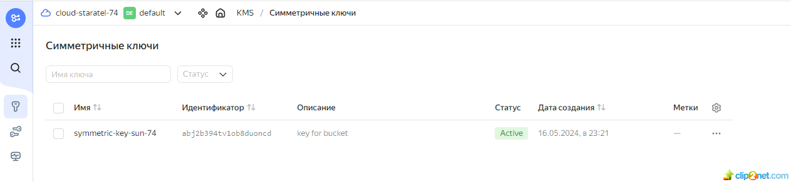
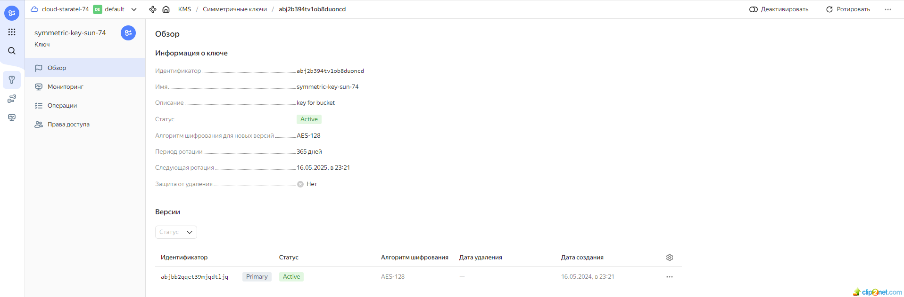
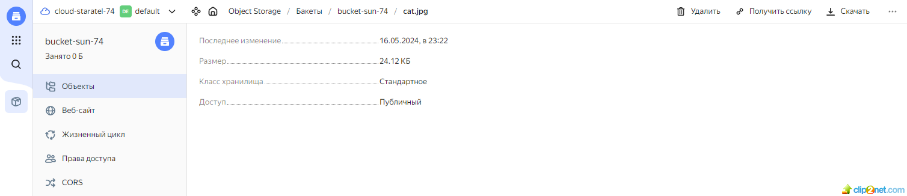

## Домашнее задание к занятию «Вычислительные мощности. Балансировщики нагрузки» 

### Задание 1. Yandex Cloud 
#### Что нужно сделать

1. С помощью ключа в KMS необходимо зашифровать содержимое бакета:
* создать ключ в KMS;
* решение:
* 01: 
* 02: 
* с помощью ключа зашифровать содержимое бакета, созданного ранее.
* решение:
* не зашифрованный бакет:
* 03: 
* зашифрованный бакет:
* 04: 

* ссылка на maim.tf - 
* ссылка на variables.tf - 

## END