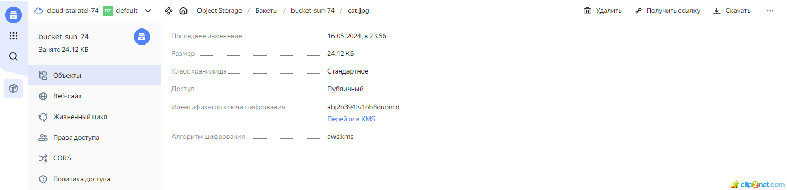

## Домашнее задание к занятию «Безопасность в облачных провайдерах» 

### Задание 1. Yandex Cloud 
#### Что нужно сделать

1. С помощью ключа в KMS необходимо зашифровать содержимое бакета:
* создать ключ в KMS;
* решение:
* 01: 
* 02: 
* с помощью ключа зашифровать содержимое бакета, созданного ранее.
* решение:
* не зашифрованный бакет:
* 03: 
* зашифрованный бакет:
* 04: 

* ссылка на maim.tf - https://github.com/staratel74/devops-netology/blob/main/cloud_project/Task_03/src/main.tf
* ссылка на variables.tf - https://github.com/staratel74/devops-netology/blob/main/cloud_project/Task_03/src/variables.tf

## END